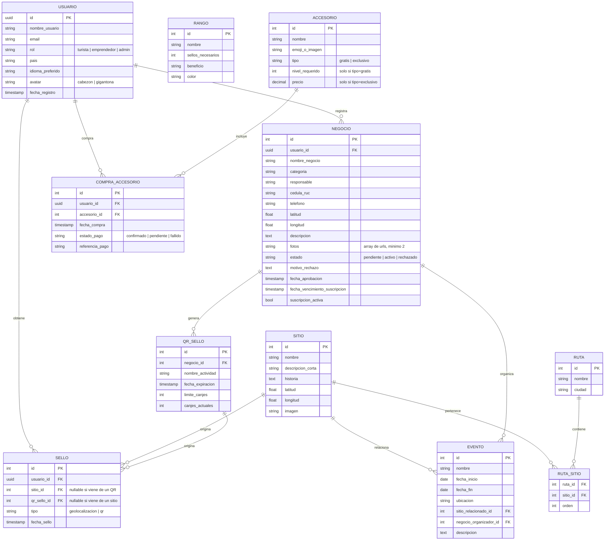

# Diagrama de base de datos — v2 (actualizado)

Este documento reemplaza a `diagrama_bd..jpeg` (versión anterior). Se generó comparando ese diagrama campo por campo contra el código real ya construido (`src/data/*.js`, `src/hooks/useSellos.js`, `src/utils/rango.js`, `src/components/Perfil.jsx`, `src/components/Tienda.jsx`) y contra el documento de especificaciones UX/UI, secciones 2 a 4.

GitHub renderiza el bloque `mermaid` de abajo automáticamente al ver este archivo en el repo — no hace falta exportar una imagen aparte.

## Decisiones tomadas al actualizarlo

- **Rango pasa a ser tabla configurable** (no un `if/else` en código como está hoy en `utils/rango.js`). Así se pueden ajustar los umbrales de nivel sin tocar código ni redesplegar. Cuando se conecte a Supabase, hay que migrar `obtenerRango()` para que haga una consulta a esta tabla en vez de tener los números fijos.
- **Se elimina la entidad `Pasaporte` como tabla separada.** En el diagrama viejo era una tabla intermedia entre Usuario y Sello, pero no aporta nada que no se pueda sacar directo de `sello.usuario_id` — es un concepto de pantalla ("Mis sellos"), no una entidad de datos distinta. Los sellos se guardan directo contra el usuario.
- **`Ruta` y `Sitio` se separan con una tabla puente** (`ruta_sitio`) en vez de que un sitio pertenezca a una sola ruta, porque el documento dice que el piloto es "escalable a más adelante" — así un sitio podría formar parte de más de una ruta en el futuro sin rediseñar.
- Se agregan las entidades que no existían en el diagrama viejo porque se construyeron después (`Ruta`, `Evento`, `Accesorio`, `Compra_Accesorio`) o porque corresponden a partes del documento de specs que aún no se han construido (`Negocio`, `QR_Sello`).
- **`Ranking` no es una tabla.** Se resuelve con una consulta (`COUNT` de sellos por usuario, filtrando por fecha si es "esta semana" o "este mes"), igual que ya lo hicimos con datos de ejemplo en `usuariosMock.js`.
- El estado de aprobación del emprendedor (pendiente/activo/rechazado) vive directo en `Negocio` en vez de una tabla aparte de "solicitudes", para no duplicar datos — se puede separar más adelante si el equipo necesita guardar historial de revisiones.
- `Usuario.id` debe coincidir con el `id` que genera Supabase Auth (uuid), para que el login con Google/correo quede ligado directo a la fila del usuario sin tabla intermedia.

## Diagrama

## Preguntas abiertas antes de crear las tablas en Supabase

Estas ya estaban en la sección 9 del documento de especificaciones, siguen sin resolverse y afectan directamente este esquema:

- ¿Stripe está disponible para cobros directos en Nicaragua? Define si `COMPRA_ACCESORIO.referencia_pago` apunta a Stripe o a otra pasarela.
- ¿Se auto-hospeda OSRM o se usa el servidor demo? No afecta tablas, pero sí si conviene guardar rutas calculadas en caché.
- ¿La curva de niveles (tabla `RANGO`) usa los umbrales sugeridos (2, 5, 8...) o el equipo prefiere otra progresión?
