# Diagrama de base de datos — v3 (propuesta para revisión)

Este documento sucede a [`diagrama_bd_v2.md`](./diagrama_bd_v2.md). Se generó a partir del
diagnóstico línea por línea del código real ya construido:

- `src/data/*.js` (`sitios.js`, `insignias.js`, `avatarPiezas.js`, `rutas.js`, `eventos.js`, `usuariosMock.js`)
- `src/hooks/*.js` (`useSellos.js`, `useNegocio.js`, `useAvatarPersonalizado.js`, `useRutasGuardadas.js`)
- `src/utils/rango.js`
- `src/components/*` (`Perfil.jsx`, `RegistroNegocio.jsx`, `PerfilNegocio.jsx`, `GenerarQR.jsx`)

GitHub renderiza el bloque `mermaid` automáticamente al ver este archivo en el repo.

**Estado:** propuesta. Todavía **no** se han creado tablas en Supabase. Revisar antes de aplicar.

---

## Qué cambia respecto a v2

### Huecos del diagnóstico que v3 cierra

| Gap detectado en el código | Cómo lo resuelve v3 |
|---|---|
| `insignias.js` + `sitio.badge`: 10 insignias 1:1 con sitios, sin tabla | Tabla nueva **`INSIGNIA`**, ligada 1:1 a `SITIO` |
| `avatarPiezas.js`: catálogo de piezas en 4 categorías (rostro/ropa/sombrero/gigantona) | Tablas nuevas **`CATEGORIA_AVATAR`** + **`PIEZA_AVATAR`** |
| `avatarDesbloqueos`: qué piezas posee el usuario | Tabla nueva **`PIEZA_DESBLOQUEADA`** |
| `avatarSeleccion`: qué pieza lleva equipada por categoría | Tabla nueva **`AVATAR_EQUIPADO`** |
| `avatarMilestonesResueltos` + `avatarCandidatosPendientes`: canje aleatorio cada 5 niveles | Tablas nuevas **`USUARIO_HITO`** + **`HITO_CANDIDATO`** |
| `useRutasGuardadas`: rutas favoritas del usuario | Tabla nueva **`RUTA_GUARDADA`** |
| `negocio.productos[]`: menú/catálogo del negocio | Tabla nueva **`PRODUCTO`** |
| `negocio.horarios`: horario de atención | Tabla nueva **`NEGOCIO_HORARIO`** |
| `RegistroNegocio.jsx` pide ≥3 fotos; v2 las tenía como `fotos[]` (viola 1NF) | Tabla nueva **`NEGOCIO_FOTO`** |
| `fotoPerfil` (dataURL en localStorage) | Campo nuevo `USUARIO.foto_perfil_url` |
| `utils/rango.js` tiene **dos** sistemas: nivel numérico 1–40 (umbrales Fibonacci) **y** rango de 3 escalones | Tablas de configuración separadas **`NIVEL`** (1–40) y **`RANGO`** (3 escalones) |
| `EVENTO` enlazaba el sitio por nombre string | `EVENTO.sitio_relacionado_id` como FK real a `SITIO` |
| `SELLO` no capturaba el origen (geo vs QR) | Se conserva `SELLO.tipo` de v2 y se añade `CHECK` de exclusividad |
| `NEGOCIO` sin `responsable`, `cedula_ruc`, `telefono`, `descripcion`, `fecha_envio` | Añadidos a `NEGOCIO` |

### Decisiones de modelado

- **Sistema de avatar = mecanismo real del código, NO tienda con pagos.** Se eliminan
  `ACCESORIO` y `COMPRA_ACCESORIO` de v2 (asumían `precio`, `estado_pago`, `referencia_pago`).
  El código implementa: piezas gratuitas organizadas en 4 categorías; cada 5 niveles
  (`PRIMER_NIVEL_DESBLOQUEO = 5`, `INTERVALO_DESBLOQUEO = 5`) se ofrecen 3 piezas al azar
  (`CANTIDAD_CANDIDATOS = 3`) y el usuario elige 1; lo elegido se desbloquea y puede equiparse.
- **`avatar_personaje` (cabezon | gigantona) es distinto de la categoría `gigantona` del avatar.**
  El primero es el personaje base que se elige en `SeleccionDanzante`; la segunda es un slot de
  personalización dentro de `avatarPiezas.js`. Son columnas/tablas separadas a propósito.
  ⚠️ El código guarda hoy `'enano'` / `'gigantona'` en `localStorage.avatarElegido`; al migrar hay
  que normalizar `'enano'` → `'cabezon'`.
- **Nada derivado se almacena** (3NF): el nivel actual, el rango actual, la cantidad de sellos y
  `canjes_actuales` de un QR se calculan con consultas (`COUNT`), no se guardan en columnas.
- **`RANGO` y `NIVEL` son tablas de configuración** sin FK: la relación con el usuario es lógica
  (`COUNT(sello)` → buscar el escalón). Reemplazan los números fijos de `utils/rango.js`
  (`obtenerRango`, `generarUmbrales`, `UMBRALES_NIVEL`).
- Se conservan de v2 sin cambios de fondo: `RUTA` + `RUTA_SITIO` con `orden`, `USUARIO.id = uuid`
  de Supabase Auth, `QR_SELLO` como tabla 1:N, estado de aprobación dentro de `NEGOCIO`,
  `Ranking` como consulta (no tabla), sin entidad `Pasaporte`.
- **`horarios`:** el código actual solo distingue "entre semana" / "fin de semana"
  (`PerfilNegocio.jsx`). `NEGOCIO_HORARIO` se modela por día (`dia_semana` 0–6) para no rediseñar
  cuando se quiera horario por día; el front puede seguir escribiendo solo 2 franjas.

### 3NF

Todas las tablas nuevas están en 3NF: clave primaria definida, cada atributo no clave depende de
la clave completa (sin dependencias parciales) y no hay atributos no clave que dependan de otro
atributo no clave (sin dependencias transitivas). Los "grupos repetidos" de v2/código
(`fotos[]`, `productos[]`, `horarios`, listas de piezas por categoría) se extraen a tablas propias.

---

## Diagrama

```mermaid
erDiagram
    USUARIO {
        uuid id PK "= auth.users.id de Supabase"
        string nombre_usuario
        string email
        string rol "turista | emprendedor | admin"
        string pais
        string idioma_preferido
        string avatar_personaje "cabezon | gigantona"
        string foto_perfil_url "nullable"
        timestamptz fecha_registro
    }

    NIVEL {
        int numero PK "1..40"
        int sellos_necesarios "umbral acumulado (curva Fibonacci de utils/rango.js)"
    }

    RANGO {
        int id PK
        string nombre "Principiante | Explorador | Maestro Güegüense"
        int sellos_necesarios "0 | 5 | 8"
        string beneficio
        string color "hex"
    }

    RUTA {
        int id PK
        string nombre
        string ciudad
    }

    SITIO {
        int id PK
        int insignia_id FK "UNIQUE — 1:1 con INSIGNIA"
        string nombre
        string descripcion_corta
        text historia
        float latitud
        float longitud
        string imagen_url "nullable"
    }

    INSIGNIA {
        int id PK
        string clave "UNIQUE — slug: cathedral, territory, guitar..."
        string nombre
        string imagen_url
    }

    RUTA_SITIO {
        int ruta_id PK,FK
        int sitio_id PK,FK
        int orden
    }

    RUTA_GUARDADA {
        uuid usuario_id PK,FK
        int ruta_id PK,FK
        timestamptz fecha_guardado
    }

    SELLO {
        bigint id PK
        uuid usuario_id FK
        int sitio_id FK "nullable si tipo = qr"
        int qr_sello_id FK "nullable si tipo = geolocalizacion"
        string tipo "geolocalizacion | qr"
        timestamptz fecha_sello
    }

    NEGOCIO {
        int id PK
        uuid usuario_id FK
        string nombre_negocio
        string categoria
        string responsable
        string cedula_ruc
        string telefono
        float latitud
        float longitud
        text descripcion
        string estado "pendiente | activo | rechazado"
        text motivo_rechazo "nullable"
        timestamptz fecha_envio
        timestamptz fecha_aprobacion "nullable"
        timestamptz fecha_vencimiento_suscripcion "nullable"
        bool suscripcion_activa
    }

    NEGOCIO_FOTO {
        int id PK
        int negocio_id FK
        string url
        string tipo "exterior | interior | producto"
        int orden
    }

    NEGOCIO_HORARIO {
        int negocio_id PK,FK
        int dia_semana PK "0=domingo .. 6=sábado"
        time hora_apertura "nullable si cerrado"
        time hora_cierre "nullable si cerrado"
        bool cerrado
    }

    PRODUCTO {
        int id PK
        int negocio_id FK
        string nombre
        int orden
    }

    QR_SELLO {
        int id PK
        int negocio_id FK
        string token "UNIQUE"
        string nombre_actividad
        string color "hex, cosmético"
        timestamptz fecha_creacion
        timestamptz fecha_expiracion "nullable"
        int limite_canjes "nullable = sin límite"
    }

    EVENTO {
        int id PK
        int sitio_relacionado_id FK "nullable"
        int negocio_organizador_id FK "nullable"
        string nombre
        date fecha_inicio
        date fecha_fin
        string ubicacion "etiqueta libre"
        text descripcion
    }

    CATEGORIA_AVATAR {
        int id PK
        string clave "UNIQUE — rostro | ropa | sombrero | gigantona"
        string nombre
        bool obligatoria "sombrero = false; resto = true"
    }

    PIEZA_AVATAR {
        int id PK
        int categoria_id FK
        string clave "UNIQUE — rostro_1, ropa_3, sombrero_2..."
        string imagen_url
        bool es_inicial "true: rostro_1, ropa_1, gigantona_1"
    }

    PIEZA_DESBLOQUEADA {
        uuid usuario_id PK,FK
        int pieza_id PK,FK
        int nivel_hito "nullable — null = pieza inicial"
        timestamptz fecha_desbloqueo
    }

    AVATAR_EQUIPADO {
        uuid usuario_id PK,FK
        int categoria_id PK,FK
        int pieza_id FK "nullable — sombrero puede ir vacío"
    }

    USUARIO_HITO {
        uuid usuario_id PK,FK
        int nivel_hito PK "5, 10, 15, 20..."
        int pieza_elegida_id FK "nullable — null = pendiente de elegir"
        timestamptz fecha_generado
        timestamptz fecha_resuelto "nullable"
    }

    HITO_CANDIDATO {
        uuid usuario_id PK,FK
        int nivel_hito PK,FK
        int pieza_id PK,FK
    }

    USUARIO ||--o{ SELLO : obtiene
    USUARIO ||--o{ NEGOCIO : registra
    USUARIO ||--o{ RUTA_GUARDADA : guarda
    USUARIO ||--o{ PIEZA_DESBLOQUEADA : posee
    USUARIO ||--o{ AVATAR_EQUIPADO : configura
    USUARIO ||--o{ USUARIO_HITO : alcanza
    USUARIO ||--o{ HITO_CANDIDATO : recibe

    SITIO ||--|| INSIGNIA : otorga
    SITIO ||--o{ RUTA_SITIO : pertenece
    RUTA ||--o{ RUTA_SITIO : contiene
    RUTA ||--o{ RUTA_GUARDADA : es_guardada
    SITIO ||--o{ SELLO : origina
    SITIO ||--o{ EVENTO : relaciona

    NEGOCIO ||--o{ NEGOCIO_FOTO : tiene
    NEGOCIO ||--o{ NEGOCIO_HORARIO : abre
    NEGOCIO ||--o{ PRODUCTO : ofrece
    NEGOCIO ||--o{ QR_SELLO : genera
    NEGOCIO ||--o{ EVENTO : organiza
    QR_SELLO ||--o{ SELLO : origina

    CATEGORIA_AVATAR ||--o{ PIEZA_AVATAR : agrupa
    CATEGORIA_AVATAR ||--o{ AVATAR_EQUIPADO : slot
    PIEZA_AVATAR ||--o{ PIEZA_DESBLOQUEADA : desbloquea
    PIEZA_AVATAR ||--o{ AVATAR_EQUIPADO : equipada
    PIEZA_AVATAR ||--o{ HITO_CANDIDATO : ofrecida
    PIEZA_AVATAR |o--o{ USUARIO_HITO : elegida
    USUARIO_HITO ||--o{ HITO_CANDIDATO : propone
```

---

## Tablas — qué reemplaza cada una

### Núcleo (adaptadas de v2)

| Tabla | Qué reemplaza / gap que resuelve |
|---|---|
| **`USUARIO`** | `localStorage.perfilUsuario` (`nombre`, `pais`, `idioma`) + `avatarElegido` + `fotoPerfil`. Añade `email`, `rol`, `fecha_registro` (no existían en código) y `foto_perfil_url` (gap del diagnóstico). `id` = uuid de Supabase Auth. |
| **`SITIO`** | El array estático de `data/sitios.js`. `name`→`nombre`, `desc`→`descripcion_corta`, `position:[lat,lng]`→`latitud`/`longitud`, `badge`→FK `insignia_id`. |
| **`RUTA`** / **`RUTA_SITIO`** | `data/rutas.js` (hoy una sola ruta con todos los sitios embebidos). Puente N:M con `orden` — sin cambios respecto a v2. |
| **`SELLO`** | El array `localStorage.sellos` de `useSellos.js`. Se **quita** el campo denormalizado `nombre` (violaba 3NF: depende de `sitio_id`). Se conserva `tipo` de v2 + `CHECK` de que exactamente uno de `sitio_id` / `qr_sello_id` esté presente. |
| **`NEGOCIO`** | El objeto `localStorage.negocio` de `useNegocio.js`. Añade `responsable`, `cedula_ruc`, `telefono`, `descripcion`, `fecha_envio` (`fechaEnvio` del código) y la suscripción de v2. Saca `fotos`, `productos`, `horarios`, `qr` a tablas propias. |
| **`QR_SELLO`** | El objeto embebido `negocio.qr` (`{token, color, fecha}`) de `GenerarQR.jsx`. Pasa a tabla 1:N con `nombre_actividad`, `fecha_expiracion`, `limite_canjes`. `canjes_actuales` **no se guarda**: es `COUNT(SELLO WHERE qr_sello_id = ...)`. |
| **`EVENTO`** | `data/eventos.js`. `sitioRelacionado` (string con el nombre) pasa a FK `sitio_relacionado_id`. Añade `negocio_organizador_id` (de v2). |

### Configuración (reemplazan código fijo)

| Tabla | Qué reemplaza / gap que resuelve |
|---|---|
| **`NIVEL`** | `generarUmbrales()` / `UMBRALES_NIVEL` / `obtenerNivel()` de `utils/rango.js`. Curva numérica 1–40 editable sin redesplegar. Alimenta los hitos de avatar. |
| **`RANGO`** | `obtenerRango()` de `utils/rango.js` (los 3 escalones con nombre y color: Principiante 0 / Explorador 5 / Maestro Güegüense 8). Igual que v2 pero ahora **coexiste** con `NIVEL` en vez de fusionarse. |

### Insignias (gap nuevo)

| Tabla | Qué reemplaza / gap que resuelve |
|---|---|
| **`INSIGNIA`** | El mapa `INSIGNIAS` de `data/insignias.js` (slug → PNG) y el campo `sitio.badge`. 1:1 con `SITIO` (`SITIO.insignia_id` es `UNIQUE`). La insignia ganada se deriva por `sello.sitio_id → sitio.insignia_id`; no se guarda en `SELLO`. |

### Negocio — grupos repetidos extraídos (3NF)

| Tabla | Qué reemplaza / gap que resuelve |
|---|---|
| **`NEGOCIO_FOTO`** | El `fotos[]` de v2 (violaba 1NF) y el `cantidadFotos` que hoy guarda `useNegocio.js` sin subir nada real. Mínimo 3 filas se valida en la app. |
| **`NEGOCIO_HORARIO`** | El objeto `negocio.horarios` (`{entreSemana, finDeSemana}` en `PerfilNegocio.jsx`). Modelado por día (`dia_semana` 0–6) para escalar a horario diario. |
| **`PRODUCTO`** | El array `negocio.productos` (`[{id, nombre}]`) de `useNegocio.js` (`agregarProducto` / `eliminarProducto`). |

### Rutas guardadas (gap nuevo)

| Tabla | Qué reemplaza / gap que resuelve |
|---|---|
| **`RUTA_GUARDADA`** | El array `localStorage.rutasGuardadas` de `useRutasGuardadas.js`. Puente N:M usuario–ruta para favoritos. |

### Avatar — mecanismo real (reemplaza `ACCESORIO` / `COMPRA_ACCESORIO` de v2)

| Tabla | Qué reemplaza / gap que resuelve |
|---|---|
| **`CATEGORIA_AVATAR`** | Los 4 slots de `data/avatarPiezas.js` (`ROSTROS`, `ROPAS`, `SOMBREROS`, `GIGANTONA`). `obligatoria = false` para `sombrero` (empieza vacío en `cargarSeleccion()`). |
| **`PIEZA_AVATAR`** | Los mapas `id → PNG` de `avatarPiezas.js` (`rostro_1`…, `ropa_1`…, etc.). `es_inicial` marca `ROSTRO_DEFECTO`, `ROPA_DEFECTO`, `GIGANTONA_DEFECTO`. |
| **`PIEZA_DESBLOQUEADA`** | `localStorage.avatarDesbloqueos` (`{rostro:[], ropa:[], sombrero:[], gigantona:[]}`). Qué piezas posee el usuario. `nivel_hito` registra qué hito la concedió (`null` = inicial). |
| **`AVATAR_EQUIPADO`** | `localStorage.avatarSeleccion` (`{rostro, ropa, sombrero, gigantona}`). Una pieza equipada por categoría; la PK `(usuario_id, categoria_id)` garantiza "una por slot". `pieza_id` nullable para sombrero vacío. |
| **`USUARIO_HITO`** | `localStorage.avatarMilestonesResueltos` + la parte "milestone/estado" de `avatarCandidatosPendientes`. Un hito por cada nivel múltiplo de 5 alcanzado. `pieza_elegida_id IS NULL` = pendiente de elegir; al elegir se setea + `fecha_resuelto` y se inserta en `PIEZA_DESBLOQUEADA`. |
| **`HITO_CANDIDATO`** | El array `opciones` de `avatarCandidatosPendientes` (`[{categoria, id}]`) que produce `elegirCandidatosAlAzar()`: las 3 piezas al azar ofrecidas para ese hito. |

### Se eliminan de v2

| Entidad v2 | Motivo |
|---|---|
| `ACCESORIO` | El código no tiene tienda: las piezas son gratuitas y se organizan por categoría. Sustituida por `CATEGORIA_AVATAR` + `PIEZA_AVATAR`. |
| `COMPRA_ACCESORIO` | No hay compra ni pago; hay canje aleatorio por hito. Sustituida por `USUARIO_HITO` + `HITO_CANDIDATO` + `PIEZA_DESBLOQUEADA`. |

---

## Reglas de integridad (para el DDL, aún no escrito)

- `SELLO`: `CHECK ((sitio_id IS NOT NULL) <> (qr_sello_id IS NOT NULL))` + `tipo` coherente con cuál está presente.
- `SELLO`: `UNIQUE (usuario_id, sitio_id)` — no se puede sellar dos veces el mismo sitio (hoy lo valida `useSellos.sellar()`).
- `SITIO.insignia_id`: `UNIQUE NOT NULL` (1:1).
- `AVATAR_EQUIPADO.pieza_id`: debe pertenecer a `categoria_id` y estar en `PIEZA_DESBLOQUEADA` de ese usuario (trigger o FK compuesta).
- `USUARIO_HITO.pieza_elegida_id`: si no es null, debe existir como `HITO_CANDIDATO` de ese `(usuario_id, nivel_hito)`.
- `HITO_CANDIDATO`: exactamente 3 filas por `(usuario_id, nivel_hito)` (validación en app; `CANTIDAD_CANDIDATOS`).
- `NEGOCIO_HORARIO`: si `cerrado = true`, `hora_apertura`/`hora_cierre` van `NULL`.
- RLS de Supabase: `USUARIO` solo su propia fila; `SELLO`/`RUTA_GUARDADA`/`PIEZA_DESBLOQUEADA`/`AVATAR_EQUIPADO`/`USUARIO_HITO`/`HITO_CANDIDATO` filtrados por `auth.uid()`; `NEGOCIO` editable por su dueño y por `admin`.

---

## Preguntas abiertas antes de crear las tablas

Heredadas de v2 (siguen sin resolver):

- ¿Pasarela de pago para la **suscripción del negocio** (`NEGOCIO.suscripcion_activa`)? Stripe no opera directo en Nicaragua. — Nota: ya **no** afecta al avatar (sin pagos), pero sí a `NEGOCIO`.
- ¿La curva de `NIVEL` usa los umbrales Fibonacci actuales de `utils/rango.js` (`0, 2, 3, 5, 8, 13, 21…`) o el equipo prefiere otra progresión?
- ¿OSRM auto-hospedado o servidor demo? Afecta si conviene cachear rutas calculadas (tabla no incluida aquí).

Nuevas de v3:

- **`avatar_personaje`**: ¿se estandariza el valor a `cabezon` (el código guarda `enano`)? Requiere migración de datos y ajustar `Perfil.jsx` / `Personalizacion.jsx` / `SeleccionDanzante`.
- **QR de negocio vs QR de sitio**: hoy `App.jsx > handleEscaneoQR` sella un **sitio pendiente real**, no un `QR_SELLO` de negocio. ¿El `SELLO.tipo = 'qr'` con `qr_sello_id` es funcionalidad futura o hay que reconciliar el flujo actual?
- **`NEGOCIO_HORARIO`**: ¿el front seguirá escribiendo solo 2 franjas (entre semana / fin de semana) y el backend las expande a 7 días, o se rediseña la UI a horario por día?
- **`EVENTO.ubicacion`** libre vs `sitio_relacionado_id`: ¿se mantienen ambos (etiqueta + FK opcional) o la ubicación siempre es un sitio?
