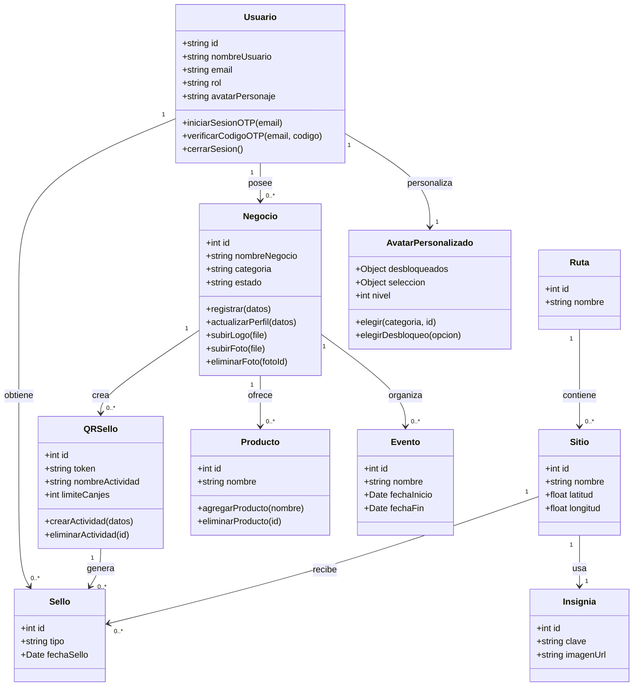
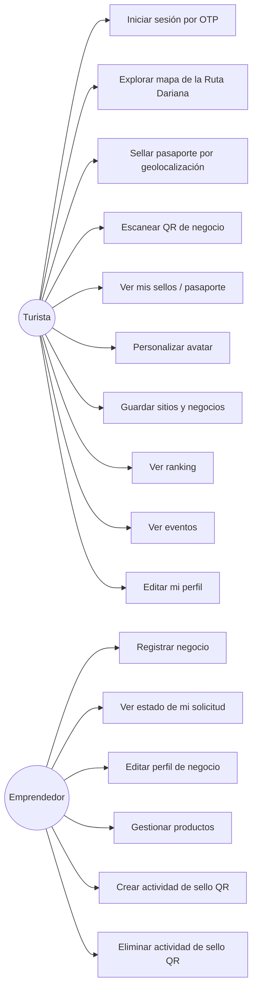
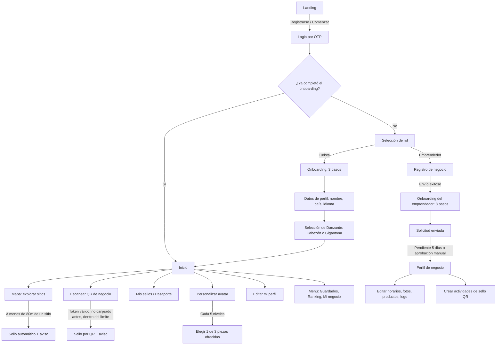

# Diagramas técnicos — Wheregüense

Generados a partir del esquema real de la base de datos en Supabase (21 tablas) y del
flujo de navegación real implementado en `src/App.jsx`. Reemplaza una versión anterior
que quedó desactualizada tras la migración completa del proyecto de `localStorage` a
Supabase.

## 1. Diagrama Entidad-Relación (3FN)

```mermaid
erDiagram
    USUARIO ||--o{ NEGOCIO : "posee"
    USUARIO ||--o{ SELLO : "obtiene"
    USUARIO ||--o{ GUARDADO : "guarda"
    USUARIO ||--o{ RUTA_GUARDADA : "guarda"
    USUARIO ||--o{ PIEZA_DESBLOQUEADA : "desbloquea"
    USUARIO ||--o{ AVATAR_EQUIPADO : "equipa"
    USUARIO ||--o{ USUARIO_HITO : "genera"

    NEGOCIO ||--o{ NEGOCIO_FOTO : "muestra"
    NEGOCIO ||--o{ NEGOCIO_HORARIO : "define"
    NEGOCIO ||--o{ PRODUCTO : "ofrece"
    NEGOCIO ||--o{ QR_SELLO : "crea"
    NEGOCIO ||--o{ EVENTO : "organiza (opcional)"

    INSIGNIA ||--|| SITIO : "identifica"
    SITIO ||--o{ SELLO : "es sellado en"
    SITIO ||--o{ RUTA_SITIO : "aparece en"
    SITIO ||--o{ EVENTO : "relaciona (opcional)"

    RUTA ||--o{ RUTA_SITIO : "contiene"
    RUTA ||--o{ RUTA_GUARDADA : "es guardada"

    QR_SELLO ||--o{ SELLO : "genera"

    CATEGORIA_AVATAR ||--o{ PIEZA_AVATAR : "clasifica"
    CATEGORIA_AVATAR ||--o{ AVATAR_EQUIPADO : "corresponde a"

    PIEZA_AVATAR ||--o{ PIEZA_DESBLOQUEADA : "es desbloqueada como"
    PIEZA_AVATAR ||--o{ AVATAR_EQUIPADO : "es usada en (opcional)"
    PIEZA_AVATAR ||--o{ HITO_CANDIDATO : "es candidata en"
    PIEZA_AVATAR ||--o{ USUARIO_HITO : "es elegida en (opcional)"

    USUARIO_HITO ||--o{ HITO_CANDIDATO : "ofrece"

    USUARIO {
        uuid id PK
        string nombre_usuario
        string email UK
        string rol
        string pais
        string idioma_preferido
        string avatar_personaje
        string foto_perfil_url
        timestamp fecha_registro
        boolean onboarding_completado
    }
    NEGOCIO {
        int id PK
        uuid usuario_id FK
        string nombre_negocio
        string categoria
        string responsable
        string cedula_ruc
        string telefono
        float latitud
        float longitud
        string descripcion
        string estado
        string motivo_rechazo
        timestamp fecha_envio
        timestamp fecha_aprobacion
        timestamp fecha_vencimiento_suscripcion
        boolean suscripcion_activa
        string logo_url
    }
    NEGOCIO_FOTO {
        int id PK
        int negocio_id FK
        string url
        string tipo
        smallint orden
    }
    NEGOCIO_HORARIO {
        int negocio_id PK_FK
        smallint dia_semana PK
        time hora_apertura
        time hora_cierre
        boolean cerrado
    }
    PRODUCTO {
        int id PK
        int negocio_id FK
        string nombre
        smallint orden
    }
    QR_SELLO {
        int id PK
        int negocio_id FK
        string token UK
        string nombre_actividad
        string color
        timestamp fecha_creacion
        timestamp fecha_expiracion
        int limite_canjes
    }
    SITIO {
        int id PK
        int insignia_id FK_UK
        string nombre
        string descripcion_corta
        string historia
        float latitud
        float longitud
        string imagen_url
    }
    INSIGNIA {
        int id PK
        string clave UK
        string nombre
        string imagen_url
    }
    SELLO {
        bigint id PK
        uuid usuario_id FK
        int sitio_id FK
        int qr_sello_id FK
        string tipo
        timestamp fecha_sello
    }
    RUTA {
        int id PK
        string nombre
        string ciudad
    }
    RUTA_SITIO {
        int ruta_id PK_FK
        int sitio_id PK_FK
        smallint orden
    }
    RUTA_GUARDADA {
        uuid usuario_id PK_FK
        int ruta_id PK_FK
        timestamp fecha_guardado
    }
    EVENTO {
        int id PK
        int sitio_relacionado_id FK
        int negocio_organizador_id FK
        string nombre
        date fecha_inicio
        date fecha_fin
        string ubicacion
        string descripcion
        string imagen_url
    }
    GUARDADO {
        uuid usuario_id PK_FK
        string tipo PK
        string referencia_id PK
        jsonb datos
        timestamp fecha_guardado
    }
    NIVEL {
        smallint numero PK
        int sellos_necesarios UK
    }
    RANGO {
        int id PK
        string nombre UK
        int sellos_necesarios UK
        string beneficio
        string color
    }
    CATEGORIA_AVATAR {
        int id PK
        string clave UK
        string nombre
        boolean obligatoria
    }
    PIEZA_AVATAR {
        int id PK
        int categoria_id FK
        string clave
        string imagen_url
        boolean es_inicial
    }
    PIEZA_DESBLOQUEADA {
        uuid usuario_id PK_FK
        int pieza_id PK_FK
        smallint nivel_hito
        timestamp fecha_desbloqueo
    }
    AVATAR_EQUIPADO {
        uuid usuario_id PK_FK
        int categoria_id PK_FK
        int pieza_id FK
    }
    USUARIO_HITO {
        uuid usuario_id PK_FK
        smallint nivel_hito PK
        int pieza_elegida_id FK
        timestamp fecha_generado
        timestamp fecha_resuelto
    }
    HITO_CANDIDATO {
        uuid usuario_id PK_FK
        smallint nivel_hito PK_FK
        int pieza_id PK_FK
    }
```

**Nota sobre 3FN:** cada tabla depende solo de su llave primaria completa. `NIVEL` y `RANGO`
son catálogos de referencia independientes (el nivel/rango de un usuario se calcula en el
código a partir de su cantidad de sellos, no se guarda como columna redundante). `SELLO` usa
un CHECK (`sello_origen_valido`) para garantizar que sea de tipo `geolocalizacion` (con
`sitio_id`) o de tipo `qr` (con `qr_sello_id`), nunca ambos ni ninguno — evita una tabla
polimórfica desnormalizada.

## 2. Diagrama de clases



## 3. Diagrama de casos de uso



> Los roles **Administrador** y **Auditor** están planificados pero aún no implementados
> como actores funcionales del sistema (ver `README.md`, sección "Roles y seguridad").

## 4. Diagrama de actividades (flujo de navegación)


