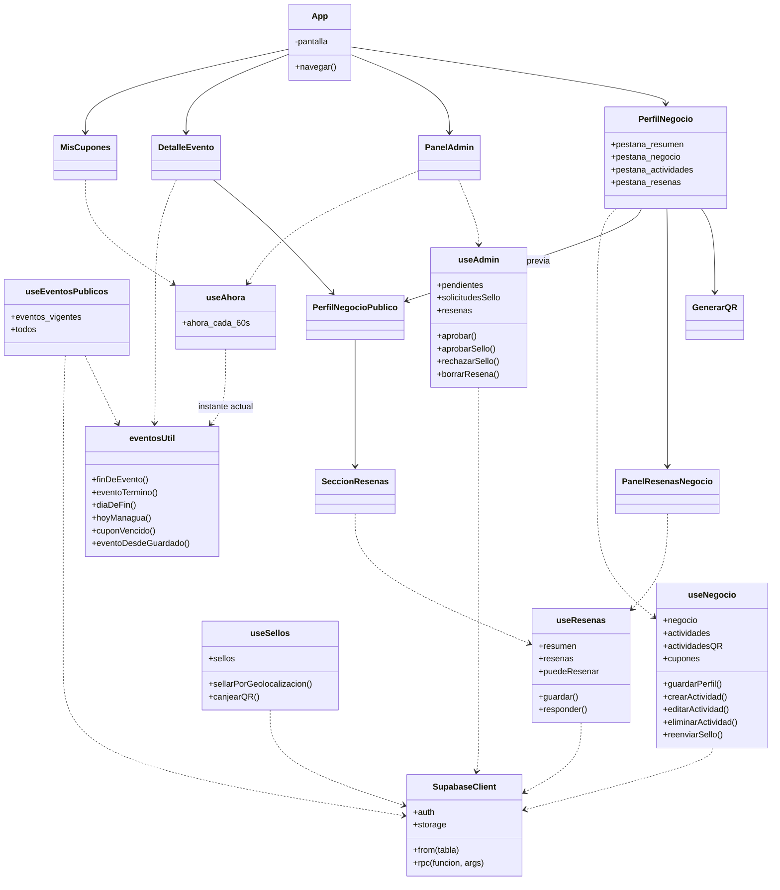
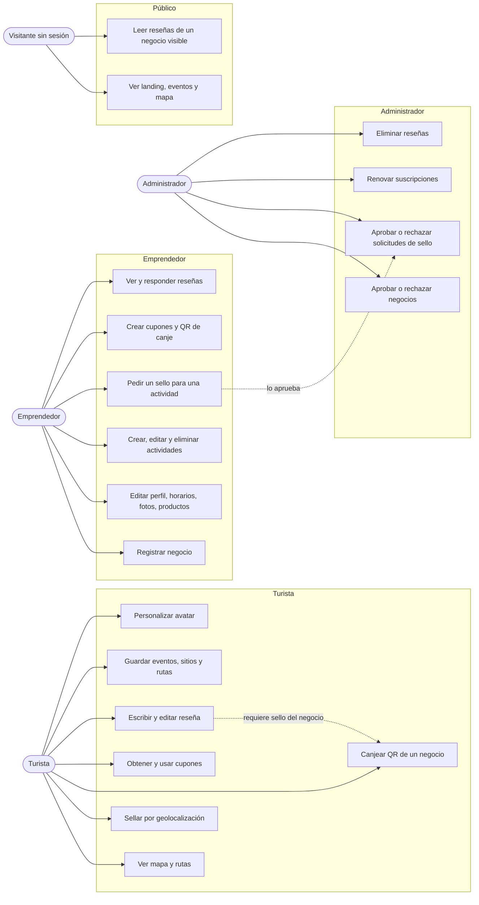
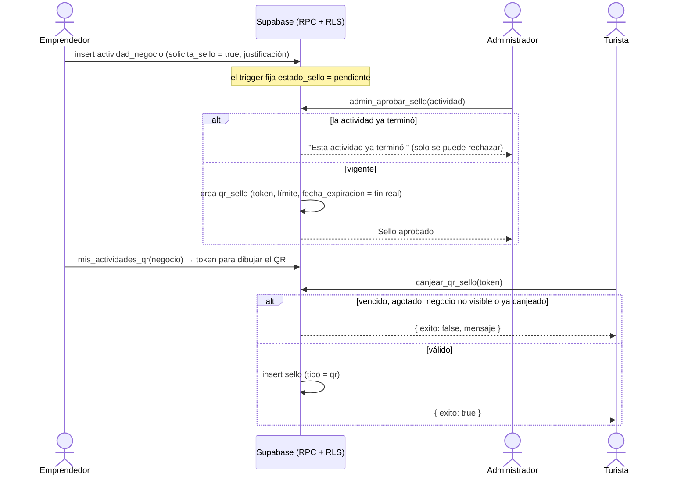
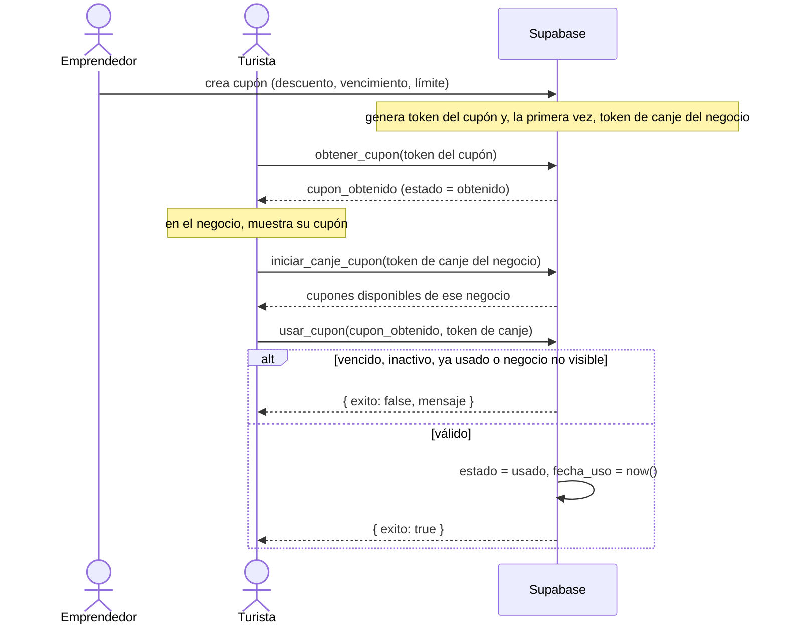
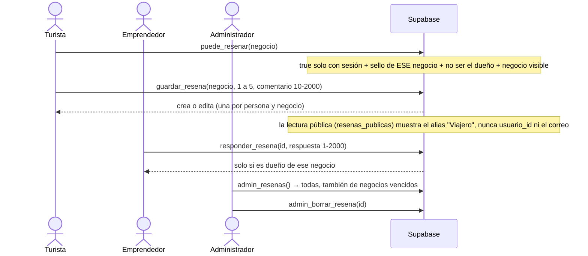
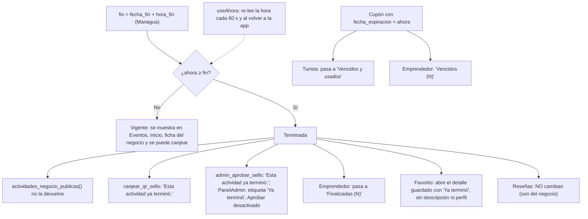
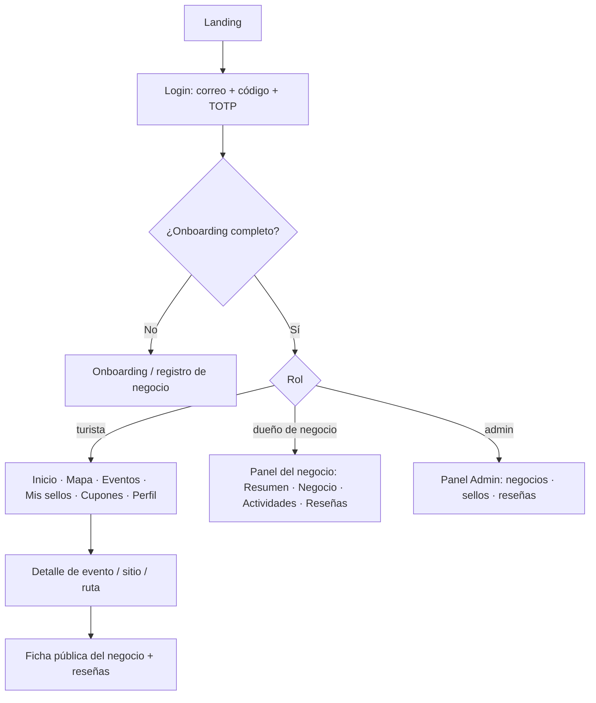

# Diagramas técnicos — Wheregüense

Vigente a la migración **033** (2026-10). Generado a partir del esquema real de Supabase (27 tablas
en `public`) y del código. GitHub dibuja los bloques `mermaid` directamente.

Los diagramas anteriores ([`diagrama_bd_v2.md`](diagrama_bd_v2.md), [`diagrama_bd_v3.md`](diagrama_bd_v3.md))
quedan como historia del diseño.

Contenido: 1. Entidad-Relación · 2. Clases · 3. Casos de uso · 4. Flujos (actividad → sello → canje,
cupón, reseña, "lo terminado desaparece").

---

## 1. Diagrama Entidad-Relación

`usuario.id` es también la clave de `auth.users` (Supabase Auth). Las columnas marcadas **(cerrada)**
no se pueden leer ni escribir directo desde la API: pasan por funciones `SECURITY DEFINER`.

```mermaid
erDiagram
    usuario ||--o{ negocio : "es dueño de"
    usuario ||--o{ sello : "obtiene"
    usuario ||--o{ guardado : "guarda"
    usuario ||--o{ ruta_guardada : "guarda"
    usuario ||--o{ cupon_obtenido : "obtiene"
    usuario ||--o{ resena : "escribe"
    usuario ||--o{ avatar_equipado : "equipa"
    usuario ||--o{ pieza_desbloqueada : "desbloquea"
    usuario ||--o{ usuario_hito : "alcanza"

    negocio ||--o{ negocio_foto : "tiene"
    negocio ||--o{ negocio_horario : "tiene"
    negocio ||--o{ producto : "ofrece"
    negocio ||--o{ actividad_negocio : "publica"
    negocio ||--o{ qr_sello : "emite"
    negocio ||--o{ cupon : "ofrece"
    negocio ||--o| negocio_token_canje : "tiene un token de canje"
    negocio ||--o{ resena : "recibe"
    negocio |o--o{ evento : "organiza"

    actividad_negocio |o--o| qr_sello : "solicita y recibe"
    actividad_negocio |o--o| evento : "se publica como"
    qr_sello ||--o{ sello : "se canjea en"
    sitio ||--o{ sello : "se sella en"
    sitio ||--o{ ruta_sitio : "forma parte de"
    ruta ||--o{ ruta_sitio : "incluye"
    ruta ||--o{ ruta_guardada : "es guardada"
    sitio }o--|| insignia : "otorga"
    sitio |o--o{ evento : "se relaciona con"

    cupon ||--o{ cupon_obtenido : "se obtiene como"

    categoria_avatar ||--o{ pieza_avatar : "agrupa"
    categoria_avatar ||--o{ avatar_equipado : "ranura"
    pieza_avatar |o--o{ avatar_equipado : "equipada en"
    pieza_avatar ||--o{ pieza_desbloqueada : "desbloqueada como"
    pieza_avatar ||--o{ hito_candidato : "ofrecida en"
    usuario_hito ||--o{ hito_candidato : "ofrece"

    usuario {
        uuid id PK "= auth.users.id"
        text nombre_usuario
        text email
        text rol "turista | admin | auditor"
        text pais
        text idioma_preferido
        text avatar_personaje "cabezon | gigantona"
        text foto_perfil_url
        timestamptz fecha_registro
        boolean onboarding_completado
    }

    negocio {
        int id PK
        uuid usuario_id FK "dueño"
        text nombre_negocio
        text categoria
        text responsable
        text cedula_ruc
        text telefono
        double latitud
        double longitud
        text descripcion
        text logo_url
        text estado "pendiente | activo | rechazado"
        text motivo_rechazo
        timestamptz fecha_envio
        timestamptz fecha_aprobacion
        timestamptz fecha_vencimiento_suscripcion
        boolean suscripcion_activa
        text nivel_suscripcion "basico | profesional"
        jsonb config_diseno
    }

    negocio_foto {
        int id PK
        int negocio_id FK
        text url
        text tipo
        smallint orden
    }

    negocio_horario {
        int negocio_id PK,FK
        smallint dia_semana PK
        time hora_apertura
        time hora_cierre
        boolean cerrado
    }

    producto {
        int id PK
        int negocio_id FK
        text nombre
        smallint orden
    }

    actividad_negocio {
        bigint id PK
        int negocio_id FK
        text nombre
        text descripcion
        text foto_url
        date fecha_inicio
        date fecha_fin
        time hora_inicio
        time hora_fin
        text categoria
        text categoria_otro
        text lugar
        text eslogan
        text detalles
        text_array etiquetas
        boolean solicita_sello
        text estado_sello "no_solicitado | pendiente | aprobado | rechazado"
        text justificacion_sello
        text motivo_rechazo_sello
        int limite_canjes
        int qr_sello_id FK
        int evento_id FK
        timestamptz fecha_creacion
    }

    qr_sello {
        int id PK
        int negocio_id FK
        text token "(cerrada)"
        text nombre_actividad
        text color
        timestamptz fecha_creacion
        timestamptz fecha_expiracion "= fin real de la actividad"
        int limite_canjes
    }

    sello {
        bigint id PK
        uuid usuario_id FK
        int sitio_id FK "si tipo = geolocalizacion"
        int qr_sello_id FK "si tipo = qr"
        text tipo "geolocalizacion | qr"
        timestamptz fecha_sello
    }

    cupon {
        bigint id PK
        int negocio_id FK
        text token "(cerrada)"
        text descripcion
        int descuento_porcentaje
        timestamptz fecha_expiracion
        int limite_total
        boolean activo
        timestamptz fecha_creacion
    }

    cupon_obtenido {
        bigint id PK
        bigint cupon_id FK
        uuid usuario_id FK
        text estado "obtenido | usado"
        timestamptz fecha_obtenido
        timestamptz fecha_uso
    }

    negocio_token_canje {
        int negocio_id PK,FK
        text token "(cerrada) QR de canje del negocio"
        timestamptz fecha_creacion
    }

    resena {
        bigint id PK
        int negocio_id FK
        uuid usuario_id FK "(cerrada)"
        smallint calificacion "1 a 5"
        text comentario "10 a 2000, obligatorio"
        timestamptz fecha
        text respuesta_emprendedor "hasta 2000"
        timestamptz fecha_respuesta
    }

    evento {
        int id PK
        int sitio_relacionado_id FK
        int negocio_organizador_id FK
        text nombre
        date fecha_inicio
        date fecha_fin
        time hora_inicio
        time hora_fin
        text ubicacion
        text descripcion
        text imagen_url
        text categoria
        text categoria_otro
        text eslogan
        text detalles
        text_array etiquetas
    }

    guardado {
        uuid usuario_id PK,FK
        text tipo PK "evento | sitio | negocio..."
        text referencia_id PK
        jsonb datos "copia para mostrarlo aunque termine"
        timestamptz fecha_guardado
    }

    sitio {
        int id PK
        int insignia_id FK
        text nombre
        text descripcion_corta
        text historia
        double latitud
        double longitud
        text imagen_url
        int radio_sello_metros
    }

    insignia {
        int id PK
        text clave
        text nombre
        text imagen_url
    }

    ruta {
        int id PK
        text nombre
        text ciudad
    }

    ruta_sitio {
        int ruta_id PK,FK
        int sitio_id PK,FK
        smallint orden
    }

    ruta_guardada {
        uuid usuario_id PK,FK
        int ruta_id PK,FK
        timestamptz fecha_guardado
    }

    nivel {
        smallint numero PK
        int sellos_necesarios
    }

    rango {
        int id PK
        text nombre
        int sellos_necesarios
        text beneficio
        text color
    }

    categoria_avatar {
        int id PK
        text clave
        text nombre
        boolean obligatoria
    }

    pieza_avatar {
        int id PK
        int categoria_id FK
        text clave
        text imagen_url
        boolean es_inicial
    }

    avatar_equipado {
        uuid usuario_id PK,FK
        int categoria_id PK,FK
        int pieza_id FK
    }

    pieza_desbloqueada {
        uuid usuario_id PK,FK
        int pieza_id PK,FK
        smallint nivel_hito
        timestamptz fecha_desbloqueo
    }

    usuario_hito {
        uuid usuario_id PK,FK
        smallint nivel_hito PK
        int pieza_elegida_id FK
        timestamptz fecha_generado
        timestamptz fecha_resuelto
    }

    hito_candidato {
        uuid usuario_id PK,FK
        smallint nivel_hito PK,FK
        int pieza_id PK,FK
    }
```

Notas de diseño:

- `sello` tiene exactamente uno de `sitio_id` o `qr_sello_id` según `tipo`. Un sello de QR es **la prueba**
  de haber visitado ese negocio: de ahí sale quién puede reseñar (`puede_resenar`).
- `actividad_negocio` y `evento` son dos cosas: la actividad es lo que el negocio gestiona; el evento es lo
  que ve el público (`crear_evento_desde_actividad`). `actividades_negocio_publicas()` solo devuelve lo no terminado.
- Una **reseña es del negocio, no de la actividad**: sigue visible aunque la actividad que dio el sello haya terminado.
- `cupon_obtenido.cupon_id` es `ON DELETE RESTRICT`: un cupón con canjes no se borra; se desactiva o vence.
- `negocio_token_canje` es una tabla aparte (no una columna de `negocio`) para que el token no se lea con el
  `select('*')` público de `negocio`.
- Funciones internas sin tabla propia: `fin_de_actividad` (la regla de "terminó"), `negocio_visible` (candado de
  suscripción), `es_duenio_negocio`, `autor_visible`.

---

## 2. Diagrama de clases

Capa de datos (hooks) y de dominio, tal como están en `src/`. Las "clases" son módulos de funciones.

---

## 3. Casos de uso

---

## 4. Flujos

### 4.1 Actividad → sello → canje

El dueño no crea el QR: lo crea el administrador al aprobar. Una actividad ya terminada no puede aprobarse (033).

### 4.2 Cupón: obtener y canjear

### 4.3 Reseña

### 4.4 "Lo terminado desaparece"

Una sola regla, en la base y en el frontend (mismos casos de prueba):
una actividad termina en `fecha_fin + hora_fin` en **America/Managua (UTC-6)**; si `hora_fin < hora_inicio`
cruza la medianoche y termina al día siguiente; sin hora, termina a las 00:00 del día siguiente.

### 4.5 Navegación (resumen)

