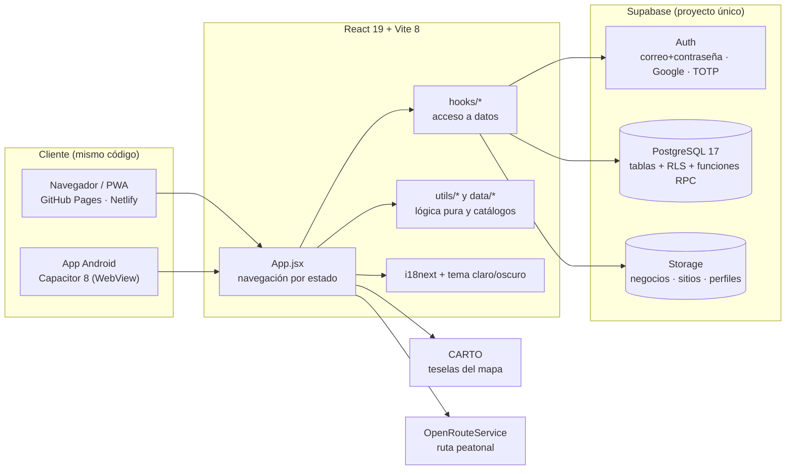
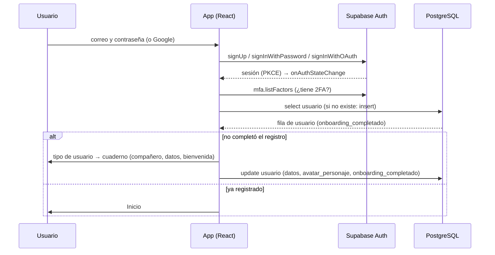
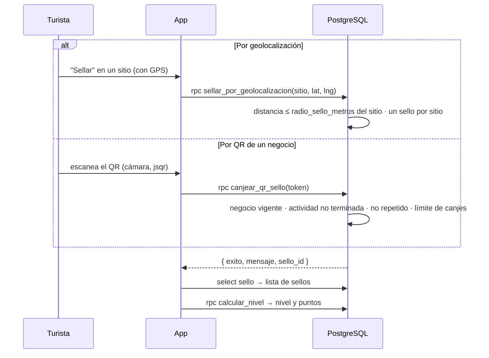

# Arquitectura

## Vista general

No hay servidor propio: el navegador (o el WebView de Android) habla **directamente** con Supabase usando la llave
pública. Toda la seguridad vive en la base de datos (RLS, permisos por columna y funciones `SECURITY DEFINER`).

## Frontend

### Pila

- **React 19 + Vite 8.** CSS plano, un archivo por componente, con variables de diseño en `src/index.css` y los
  colores de modo oscuro en `src/tema.css`.
- **Sin router.** `App.jsx` guarda la pantalla actual en un estado (`pantalla`) y devuelve el componente que le
  corresponde. Las pantallas más importantes: `landing`, `login`, `proposito` (turista/emprendedor), `cuaderno`
  (registro del turista), `inicio`, `mapa`, `eventos`, `pasaporte`, `pasaporteVisual`, `personalizacion`,
  `perfil`, `menu`, y las del emprendedor (`registroNegocio`, `estadoNegocio`, `perfilNegocio` con pestañas) y
  `panelAdmin`. Por eso no hay enlaces profundos ni problemas al refrescar en GitHub Pages.
- **Hooks de datos** (`src/hooks`): cada uno concentra las consultas de un tema —
  `useSellos`, `useNivel`, `useNegocio`, `useNegociosActivos`, `useEventosPublicos`, `useResenas`,
  `useResenasSitio`, `useSitioGaleria`, `useGuardados`, `useCuponesTurista`, `useCuponesNegocio`, `useAdmin`,
  `useAvatarPersonalizado`, `useRangosSitios`… Los componentes no llaman a Supabase directo salvo casos puntuales.
- **Catálogos estáticos** (`src/data`): `sitios.js` (89 sitios con coordenadas, textos e insignias), `rutas.js`,
  `eventos.js`, `insignias.js` y las piezas del avatar. Ver "Límites conocidos" abajo.
- **Utilidades puras** (`src/utils`): rangos y puntos, reglas de fin de actividad, esquema del diseño del negocio,
  formato de fechas por idioma, número y ruta favorita del pasaporte, validación de datos del registro, fotos.
- **Pila de pantallas modales** (`utils/pilaPantallas.js`): al abrir una ventana encima de otra, la de abajo y la
  página quedan inertes (teclado y foco solo en la de arriba).

### Autenticación en el cliente (`src/lib/supabaseClient.js`)

El cliente se crea con `flowType: 'pkce'` y `detectSessionInUrl: true`. `App.jsx` escucha
`onAuthStateChange`: al haber sesión carga (o crea) la fila de `usuario` y decide la pantalla —
`proposito` si no terminó el registro, `inicio` si ya lo hizo—. Además, todo usuario con sesión debe tener **2FA
(TOTP)**: si no tiene factor verificado se le pide activarlo (`MfaEnrolamiento`), y si ya lo tiene se le pide el
código (`MfaChallenge`).

### PWA y Capacitor

- **PWA:** `vite-plugin-pwa` (Workbox `generateSW`) precachea solo los archivos estáticos; **no** cachea llamadas
  a Supabase ni a CARTO, para que sellos, negocios y mapa vayan siempre a la red.
- **Capacitor 8:** empaqueta `dist/` en un WebView (`appId: com.capncode.whereguense`). Plugins: SplashScreen y
  StatusBar. Ver [ANDROID.md](ANDROID.md).
- **Bases (`base`)**: `./` para el navegador y Android; `/Whereguense/` con `--mode pages` para GitHub Pages.

### Idioma y tema

- `i18n.js` (es/en, detecta el idioma guardado o el del navegador, español por defecto). Fechas y textos que se
  dibujan fuera de React usan `utils/idioma.js`.
- `tema.js` guarda `claro`/`oscuro` en `localStorage` y pone la clase `dark` en `<html>`; `index.html` la aplica antes
  de dibujar para evitar el parpadeo.

## Backend (Supabase)

| Servicio | Uso |
| --- | --- |
| **Auth** | Correo + contraseña, Google (OAuth), TOTP obligatorio. PKCE. |
| **Base de datos** | 30 tablas con RLS, 58 funciones en `public` (incluidas las de los triggers) y 12 triggers. Ver [BASE_DE_DATOS.md](BASE_DE_DATOS.md). |
| **Storage** | Buckets `negocios`, `sitios` y `perfiles` (públicos para leer, con límites de tamaño y de tipo). |

Principios de seguridad de la base:

1. **Tablas sensibles cerradas.** `resena`, `resena_sitio`, `cupon` y los tokens de QR no se leen ni se escriben
   directo: todo pasa por funciones `SECURITY DEFINER` que validan sesión, propiedad y reglas de negocio.
2. **Permisos por columna.** Por ejemplo, un dueño solo puede actualizar las columnas seguras de su `negocio`; nunca
   el estado, la suscripción ni el plan.
3. **Reglas en la base, no en el cliente.** Distancia al sitio, límite de canjes, vigencia de la suscripción, fin de
   una actividad, formato de teléfonos y URLs de fotos se validan en SQL (CHECK y triggers).
4. **Un solo administrador**, fijado en la migración 025.

## Flujo de datos principal

### Inicio de sesión y registro del turista

### Obtener un sello

### Negocios y actividades

1. El emprendedor registra su negocio (`negocio.estado = 'pendiente'`).
2. El administrador lo aprueba (`admin_aprobar_negocio`): pasa a `activo` con suscripción de 6 meses.
3. El negocio crea **actividades** (`actividad_negocio`). Si pide sello, el administrador la aprueba
   (`admin_aprobar_sello`), que crea el `qr_sello`. Las actividades con fechas aparecen en Eventos
   (`actividades_negocio_publicas`) y desaparecen solas cuando terminan.
4. El turista escanea el QR y canjea el sello; después puede **reseñar** ese negocio.

### Fotos

El cliente reduce la imagen, la sube a Storage (`negocios/<uid>/…`, `perfiles/<uid>/perfil.jpg`) y guarda la URL
pública en la fila correspondiente; la base valida que la URL pertenezca al bucket y a la carpeta de su dueño.
Las fotos de los sitios turísticos las sube solo el administrador con un script y la `service_role`.

## Límites conocidos

- **Catálogo de sitios:** `src/data/sitios.js` tiene **89** sitios; la tabla `sitio` de la base tiene **60**. Solo
  los que existen en la base pueden sellarse por geolocalización.
- **Accesorios del avatar:** la tabla `accesorio_avatar` (Sombrero, Bufanda, Máscara, Corona por nivel) existe, pero
  la interfaz todavía no la usa para desbloquear ni equipar nada: lo que se ve en el avatar viene del sistema de
  piezas (`pieza_avatar`, `pieza_desbloqueada`, `avatar_equipado`). En la Tienda aparecen como lista con candado.
- **Tabla `nivel`** (umbrales por cantidad de sellos) quedó sin uso tras la migración 038; el nivel se calcula por
  puntos.
- **Android y Google:** el inicio de sesión con Google abre el navegador y no está resuelto el regreso a la app.
