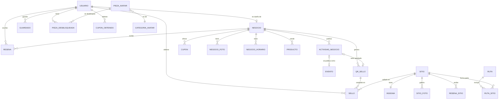

# Base de datos

Supabase (PostgreSQL 17), proyecto `spybqychnydgvidwjrlh`, región us-east-1. Esquema `public`, **30 tablas**,
todas con Row Level Security (RLS) activada. Las migraciones están en `docs/migrations/` y se aplican en orden
numérico (sin `begin/commit` propios al usar `apply_migration`).

Leyenda: **NN** = no nulo · **def** = tiene valor por defecto · `→ tabla` = clave foránea.

## 1. Tablas

### Usuarios y avatar

**`usuario`** — una fila por cuenta de Auth (`id` → `auth.users`).
`id uuid`, `nombre_usuario text NN`, `email text NN`, `rol text NN def` (CHECK: `turista` | `emprendedor` | `admin` |
`auditor`; en uso: `turista` y `admin`), `pais text`,
`idioma_preferido text NN def` (`es`/`en`), `avatar_personaje text NN def` (`cabezon` | `gigantona`),
`foto_perfil_url text`, `fecha_registro timestamptz NN def`, `onboarding_completado boolean NN def`,
`fecha_nacimiento date`, `telefono text`, `genero text`.
Restricciones (040): fecha entre 1900-01-01 y hoy; teléfono `+<código> <dígitos>`; género
`masculino | femenino | prefiero_no_decir`; `foto_perfil_url` solo `…/perfiles/<id propio>/perfil.jpg`.
En la práctica un *emprendedor* no se distingue por el rol: es un `usuario` que tiene una fila en `negocio`.

**`categoria_avatar`** (`id`, `clave`, `nombre`, `obligatoria`) — categorías de piezas: `rostro`, `ropa`, `sombrero`, `gigantona`.
**`pieza_avatar`** (`id`, `categoria_id` → categoria_avatar, `clave`, `imagen_url`, `es_inicial`) — catálogo de piezas.
**`pieza_desbloqueada`** (`usuario_id` → usuario, `pieza_id` → pieza_avatar, `nivel_hito`, `fecha_desbloqueo`) — piezas que ya tiene el usuario.
**`avatar_equipado`** (`usuario_id`, `categoria_id`, `pieza_id`) — qué pieza lleva puesta en cada categoría.
**`usuario_hito`** (`usuario_id`, `nivel_hito`, `pieza_elegida_id`, `fecha_generado`, `fecha_resuelto`) y
**`hito_candidato`** (`usuario_id`, `nivel_hito`, `pieza_id`) — las 3 piezas que se ofrecen en cada hito de nivel y la elegida.
**`accesorio_avatar`** (`id`, `nombre`, `imagen_url`, `nivel_requerido`) — Sombrero de Palma (5), Bufanda Dariana (10),
Máscara del Güegüense (20), Corona de Maestro (30). Hoy sin uso en la interfaz y con `imagen_url` vacío.

### Sitios, rutas y sellos

**`sitio`** — `id`, `insignia_id` → insignia (1 a 1), `nombre`, `descripcion_corta`, `historia`, `latitud`, `longitud`,
`imagen_url`, `radio_sello_metros NN def` (80), `rango NN def` (`rango_sello`: `cobre`|`plata`|`oro`), `ciudad NN def` (`León`).
**`insignia`** (`id`, `clave`, `nombre`, `imagen_url`) — la imagen del sello de cada sitio.
**`ruta`** (`id`, `nombre`, `ciudad`) y **`ruta_sitio`** (`ruta_id`, `sitio_id`, `orden`) — hoy una ruta: *Ruta Dariana*.
**`ruta_guardada`** (`usuario_id`, `ruta_id`, `fecha_guardado`).
**`sello`** — `id`, `usuario_id` → usuario, `sitio_id` → sitio (null si es por QR), `qr_sello_id` → qr_sello (null si es por
geolocalización), `tipo` (`geolocalizacion` | `qr`), `fecha_sello`. Un sello por usuario y sitio, y uno por usuario y QR.
**`sitio_foto`** (`id`, `sitio_id`, `url`, `orden`, `es_portada`, `creado_en`) — galería de cada sitio (037).
**`resena_sitio`** (`id uuid`, `sitio_id`, `usuario_id` → auth.users, `texto` 10–1000, `estrellas` 1–5, `creado_en`).
**`guardado`** (`usuario_id`, `tipo` `ruta` | `sitio` | `ubicacion` | `negocio` | `evento`, `referencia_id`, `datos jsonb`, `fecha_guardado`) — favoritos.
**`nivel`** y **`rango`** — tablas antiguas de umbrales por cantidad de sellos; **sin uso** desde la 038.

### Negocios

**`negocio`** — `id`, `usuario_id` → usuario (dueño), `nombre_negocio`, `categoria`, `responsable`, `cedula_ruc`,
`telefono`, `latitud`, `longitud`, `descripcion`, `estado NN def` (`pendiente` | `activo` | `rechazado`),
`motivo_rechazo`, `fecha_envio`, `fecha_aprobacion`, `fecha_vencimiento_suscripcion`, `suscripcion_activa`,
`logo_url`, `nivel_suscripcion NN def` (`profesional`), `config_diseno jsonb NN def` (esquema cerrado, ver
FUNCIONALIDADES).
**`negocio_horario`** (`negocio_id`, `dia_semana` 0–6, `hora_apertura`, `hora_cierre`, `cerrado`).
**`negocio_foto`** (`id`, `negocio_id`, `url`, `tipo` `exterior` | `interior` | `producto`, `orden`, `creado_en`) — máximo 10 por negocio.
**`producto`** (`id`, `negocio_id`, `nombre`, `orden`).
**`actividad_negocio`** — `id bigint`, `negocio_id`, `nombre`, `descripcion`, `foto_url`, `categoria`, `categoria_otro`,
`lugar`, `fecha_inicio`, `fecha_fin`, `hora_inicio`, `hora_fin`, `eslogan`, `detalles`, `etiquetas text[]`,
`solicita_sello`, `limite_canjes`, `estado_sello` (`no_solicitado` | `pendiente` | `aprobado` | `rechazado`),
`justificacion_sello`, `motivo_rechazo_sello`, `qr_sello_id` → qr_sello, `evento_id` → evento, `fecha_creacion`.
**`qr_sello`** (`id`, `negocio_id`, `token`, `nombre_actividad`, `color`, `fecha_creacion`, `fecha_expiracion`, `limite_canjes`) —
el `token` no se puede leer con la llave pública.
**`evento`** (`id`, `sitio_relacionado_id`, `negocio_organizador_id`, `nombre`, `fecha_inicio`, `fecha_fin`, `ubicacion`,
`descripcion`, `imagen_url`, `categoria`, `categoria_otro`, `hora_inicio`, `hora_fin`, `eslogan`, `detalles`, `etiquetas`).
**`cupon`** (`id`, `negocio_id`, `token`, `descripcion`, `descuento_porcentaje`, `fecha_expiracion`, `limite_total`, `activo`,
`fecha_creacion`), **`cupon_obtenido`** (`id`, `cupon_id`, `usuario_id`, `estado` `obtenido|usado`, `fecha_obtenido`,
`fecha_uso`) y **`negocio_token_canje`** (`negocio_id`, `token`, `fecha_creacion`) — el QR de canje del negocio.
**`resena`** (`id bigint`, `negocio_id`, `usuario_id`, `calificacion` 1–5, `comentario` 10–2000, `fecha`,
`respuesta_emprendedor`, `fecha_respuesta`) — una por usuario y negocio.

## 2. Relaciones

## 3. Migraciones (001 a 040)

Cada archivo vive en `docs/migrations/NNN_nombre.sql`. Las que cambian comportamiento tienen su prueba con
rollback en `docs/tests/` (ver `docs/tests/README.md`).

| N.º | Archivo | Qué hace |
| --- | --- | --- |
| 001 | `schema_inicial` | Tablas base: usuario, sitio, ruta, sello, negocio, qr_sello, evento, avatar… |
| 002 | `rls_policies` | Políticas RLS iniciales |
| 003 | `seed` | Datos iniciales (sitios, rutas, insignias, niveles, piezas) |
| 004 | `auth_onboarding` | `usuario.onboarding_completado` (señal entre dispositivos) |
| 005 | `guardados` | Tabla de favoritos |
| 006 | `storage_negocios` | Bucket `negocios` y sus políticas por carpeta del dueño |
| 007 | `estado_real_produccion` | Documenta el estado real de producción (permisos de `negocio` ya cerrados) |
| 008 | `endurecimiento_qr` | `qr_sello.token` ilegible con la llave pública; `canjear_qr_sello` sin carreras |
| 009 | `correccion_coordenadas_sitio` | Corrige coordenadas de sitios |
| 010 | `validacion_distancia_sello` | `radio_sello_metros`, `distancia_metros` y `sellar_por_geolocalizacion` |
| 011 | `expansion_ruta_completa` | Amplía el catálogo de sitios y la ruta |
| 012 | `base_candado_suscripcion` | Columnas de suscripción de `negocio` |
| 013 | `insert_negocio_por_columna` | Permisos de INSERT por columna en `negocio` |
| 014 | `renovar_suscripcion_acumula` | `admin_renovar_suscripcion` suma meses al vencimiento |
| 015 | `negocio_anon_solo_lectura` | `anon` solo lee `negocio` |
| 016 | `candado_suscripcion` | Un negocio es visible solo si está `activo` y su suscripción vigente |
| 017 | `canje_qr_negocio_vigente` | `canjear_qr_sello` rechaza negocios vencidos |
| 018 | `borrar_actividad_qr_fecha_invalida` | Corrige el borrado de QR con fechas inválidas |
| 019 | `resenas` | Tabla `resena` y reglas (1 por usuario/negocio, solo con sello) |
| 020 | `nivel_suscripcion_y_config_diseno` | `negocio.nivel_suscripcion` y `config_diseno` |
| 021 | `actividad_negocio_y_solicitud_sello` | Actividades del negocio y solicitud de sello |
| 022 | `actividad_negocio_publica` | Lectura pública de actividades |
| 023 | `actividades_negocio_publicas_funcion` | `actividades_negocio_publicas()` |
| 024 | `revocar_crear_actividad_qr` | Los QR de sello solo nacen por actividad + aprobación |
| 025 | `admin_confirmado_y_sin_autoaprobacion` | Admin único; el admin no aprueba sellos de su propio negocio |
| 026 | `actividad_foto_y_limite_canjes` | `foto_url` y `limite_canjes` en actividades |
| 027 | `cupones` | Cupones, cupones obtenidos y token de canje del negocio |
| 028 | `campos_actividades_y_eventos` | Categoría, horas, eslogan, detalles y etiquetas |
| 029 | `categoria_otro_y_obligatorios` | "Otro" con texto y campos obligatorios por trigger |
| 030 | `detalle_editar_eliminar` | `eliminar_actividad`, `eliminar_cupon` y validación de edición |
| 031 | `lo_terminado_desaparece` | `fin_de_actividad`: lo terminado deja de ofrecerse |
| 032 | `resenas` (funciones) | Reseñas solo por funciones, con alias "Viajero" |
| 033 | `aprobar_sello_no_terminada` | No se aprueba el sello de una actividad terminada |
| 034 | `limpieza_seguridad` | Nadie cambia su propio rol; permisos y EXECUTE ajustados |
| 035 / 035b / 035c | `config_diseno_*` | Un solo plan; esquema cerrado de `config_diseno` (logo, descripción, ubicación) y límites del bucket |
| 036 | `negocio_foto_galeria` | Galería del negocio (máx. 10), validación de URL y `ordenar_fotos_negocio` |
| 037 | `sitio_galeria_resenas` | Bucket `sitios`, `sitio_foto`, `resena_sitio` y sus funciones |
| 038 | `niveles_rangos_sellos` | Rangos cobre/plata/oro, `calcular_nivel`, accesorios por nivel |
| 039 | `sitio_ciudad` | `sitio.ciudad` (pasaporte por ciudad) |
| 040 | `usuario_datos_registro` | Fecha de nacimiento, teléfono, género, foto validada y bucket `perfiles` (+ `_rollback.sql`) |

## 4. Funciones principales

Todas en `public`. Las de lectura pública y las acciones del usuario están detalladas en
[API_SUPABASE.md](API_SUPABASE.md). Resumen por tema:

- **Sellos:** `sellar_por_geolocalizacion`, `canjear_qr_sello`, `distancia_metros`, `valor_sello`.
- **Niveles:** `calcular_nivel(uuid)`, `nivel_por_puntos(numeric)`, `accesorios_desbloqueados(uuid)`.
- **Actividades y eventos:** `actividades_negocio_publicas`, `mis_actividades_qr`, `sellos_entregados_por_actividad`,
  `crear_evento_desde_actividad`, `eliminar_actividad`, `fin_de_actividad`.
- **Cupones:** `obtener_cupon`, `iniciar_canje_cupon`, `usar_cupon`, `mis_cupones_*`, `eliminar_cupon`.
- **Reseñas:** `resenas_publicas`, `resumen_resenas`, `puede_resenar`, `guardar_resena`, `responder_resena`; y
  de sitios `resenas_sitio_publicas`, `resumen_resenas_sitio`, `guardar_resena_sitio`, `eliminar_mi_resena_sitio`.
- **Administración:** `admin_aprobar_negocio`, `admin_rechazar_negocio`, `admin_renovar_suscripcion`,
  `admin_aprobar_sello`, `admin_rechazar_sello`, `admin_resenas`, `admin_borrar_resena`, `admin_resenas_sitio`,
  `admin_borrar_resena_sitio`.
- **Ayuda interna:** `negocio_visible`, `es_duenio_negocio`, `autor_visible`, `config_diseno_valido`, `etiquetas_validas`.

## 5. Triggers

| Tabla | Trigger | Cuándo | Para qué |
| --- | --- | --- | --- |
| `usuario` | `usuario_proteger_rol` | BEFORE INSERT/UPDATE | Nadie se cambia el rol desde la API; las filas nuevas nacen `turista` |
| `actividad_negocio` | `…_estado_sello` | BEFORE INSERT/UPDATE | Calcula `estado_sello` (el dueño no lo escribe) |
| `actividad_negocio` | `…_exigir_obligatorios` / `…_edicion` | BEFORE INSERT / UPDATE | Exige categoría, descripción ≥ 20, foto, fechas, horas, lugar y, con sello, justificación y límite |
| `actividad_negocio` | `…_sincronizar` | AFTER UPDATE | Al editar la actividad, actualiza el nombre y el vencimiento de su `qr_sello` y el nombre, fechas y descripción de su `evento` |
| `cupon` | `cupon_asegurar_token_canje` | AFTER INSERT | Crea el token de canje del negocio la primera vez |
| `cupon` | `cupon_validar_edicion` | BEFORE UPDATE | Valida qué se puede editar |
| `qr_sello` | `qr_sello_proteger_borrado` | BEFORE DELETE | No se borra el QR de una actividad |
| `resena` | `resena_exigir_comentario` | BEFORE INSERT | Comentario de 10 a 2000 caracteres |
| `resena` | `resena_validar_update` | BEFORE UPDATE | Separa lo que edita el autor de lo que edita el dueño |
| `negocio_foto` | `negocio_foto_validar` | BEFORE INSERT | URL en la carpeta del dueño y máximo 10 fotos |
| `sitio_foto` | `sitio_foto_validar` | BEFORE INSERT/UPDATE | URL del sitio correcto; una sola portada |

## 6. Seguridad (RLS y permisos)

- **RLS activada en las 30 tablas.** Hay 45 políticas en `public` y 8 en `storage.objects`. `negocio` tiene además
  una política de lectura para el rol `auditor` (sin uso hoy).
- **Lectura pública (anon + authenticated):** catálogos (`sitio`, `insignia`, `ruta`, `ruta_sitio`, `categoria_avatar`,
  `pieza_avatar`, `nivel`, `rango`), `evento`, `sitio_foto`, y lo visible de un negocio (`negocio`, `negocio_foto`,
  `negocio_horario`, `producto`, `qr_sello` sin token): solo si el negocio está `activo` y con suscripción vigente
  (`negocio_visible`), o si es del propio dueño o del admin.
- **Propio del usuario (`authenticated`, `auth.uid() = usuario_id`):** `usuario`, `guardado`, `ruta_guardada`,
  `pieza_desbloqueada`, `avatar_equipado`, `usuario_hito`, `hito_candidato` (todo), `sello` (solo lectura), `cupon_obtenido`
  (solo lectura).
- **Dueño de negocio:** inserta y actualiza solo su `negocio` y solo columnas seguras; administra sus horarios, fotos,
  productos, actividades y cupones. **Nunca** puede cambiar `estado`, suscripción ni plan.
- **Cerradas del todo a la API:** `resena`, `resena_sitio`, `negocio_token_canje` y los tokens (`qr_sello.token`,
  `cupon.token`). Se usan solo con funciones `SECURITY DEFINER`.
- **Escritura solo con `service_role`:** `sitio`, `insignia`, `sitio_foto`, `accesorio_avatar` y el bucket `sitios`.
- **Administrador:** una sola cuenta (`rol = 'admin'`, fijada en la 025). Las funciones `admin_*` comprueban el rol por dentro.
- **Funciones:** las `SECURITY DEFINER` revisan sesión y propiedad dentro; las internas no tienen `EXECUTE` para
  `anon`/`authenticated`. Las acciones del turista exigen sesión (`anon` no puede ejecutarlas).
- **2FA:** el cliente exige TOTP a todo usuario con sesión.
