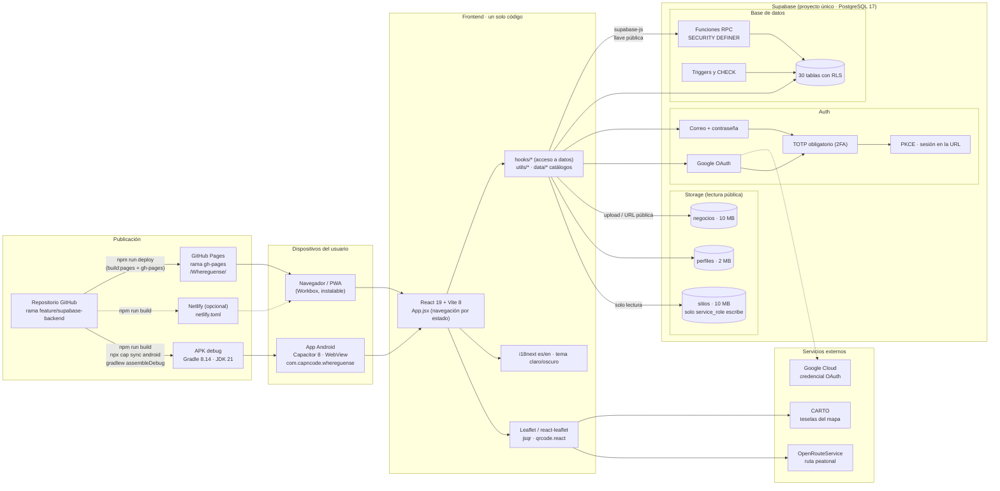

# Diagrama de arquitectura

Frontend (React / Vite / Capacitor), backend (Supabase: Auth, base de datos y Storage), servicios externos y
publicación (GitHub Pages y APK). Imagen: [`diagrama_arquitectura.png`](diagrama_arquitectura.png).

