# Diagrama de la base de datos

Las 30 tablas del esquema `public` tras las migraciones 001 a 040, con sus columnas principales y claves foráneas.
Imagen: [`diagrama_base_de_datos.png`](diagrama_base_de_datos.png).

`nivel`, `rango` y `accesorio_avatar` no tienen claves foráneas (`nivel` y `rango` están sin uso desde la 038).

```mermaid
erDiagram
  AUTH_USERS ||--|| USUARIO : "id"
  AUTH_USERS ||--o{ RESENA_SITIO : "usuario_id"

  USUARIO {
    uuid id PK
    text nombre_usuario
    text email
    text rol "turista|emprendedor|admin|auditor"
    text pais
    text idioma_preferido "es|en"
    text avatar_personaje "cabezon|gigantona"
    text foto_perfil_url
    bool onboarding_completado
    date fecha_nacimiento "040"
    text telefono "040"
    text genero "040"
  }

  NEGOCIO {
    int id PK
    uuid usuario_id FK
    text nombre_negocio
    text categoria
    float latitud
    float longitud
    text estado "pendiente|activo|rechazado"
    timestamptz fecha_vencimiento_suscripcion
    text nivel_suscripcion
    text logo_url
    jsonb config_diseno "esquema cerrado"
  }
  NEGOCIO_HORARIO {
    int negocio_id FK
    smallint dia_semana
    time hora_apertura
    time hora_cierre
    bool cerrado
  }
  NEGOCIO_FOTO {
    int id PK
    int negocio_id FK
    text url
    text tipo "exterior|interior|producto"
    smallint orden
  }
  PRODUCTO {
    int id PK
    int negocio_id FK
    text nombre
    smallint orden
  }
  NEGOCIO_TOKEN_CANJE {
    int negocio_id FK
    text token "QR de canje"
  }
  ACTIVIDAD_NEGOCIO {
    bigint id PK
    int negocio_id FK
    text nombre
    date fecha_inicio
    date fecha_fin
    text categoria
    bool solicita_sello
    text estado_sello "no_solicitado|pendiente|aprobado|rechazado"
    int limite_canjes
    int qr_sello_id FK
    int evento_id FK
  }
  QR_SELLO {
    int id PK
    int negocio_id FK
    text token
    text nombre_actividad
    timestamptz fecha_expiracion
    int limite_canjes
  }
  EVENTO {
    int id PK
    int sitio_relacionado_id FK
    int negocio_organizador_id FK
    text nombre
    date fecha_inicio
    date fecha_fin
    text categoria
  }
  CUPON {
    bigint id PK
    int negocio_id FK
    text token
    int descuento_porcentaje
    timestamptz fecha_expiracion
    int limite_total
    bool activo
  }
  CUPON_OBTENIDO {
    bigint id PK
    bigint cupon_id FK
    uuid usuario_id FK
    text estado "obtenido|usado"
    timestamptz fecha_uso
  }
  RESENA {
    bigint id PK
    int negocio_id FK
    uuid usuario_id FK
    smallint calificacion "1-5"
    text comentario "10-2000"
    text respuesta_emprendedor
  }

  SITIO {
    int id PK
    int insignia_id FK
    text nombre
    float latitud
    float longitud
    int radio_sello_metros "80"
    rango_sello rango "cobre|plata|oro"
    text ciudad
  }
  INSIGNIA {
    int id PK
    text clave
    text nombre
    text imagen_url
  }
  SITIO_FOTO {
    int id PK
    int sitio_id FK
    text url
    int orden
    bool es_portada
  }
  RESENA_SITIO {
    uuid id PK
    int sitio_id FK
    uuid usuario_id FK
    int estrellas "1-5"
    text texto "10-1000"
  }
  RUTA {
    int id PK
    text nombre
    text ciudad
  }
  RUTA_SITIO {
    int ruta_id FK
    int sitio_id FK
    smallint orden
  }
  RUTA_GUARDADA {
    uuid usuario_id FK
    int ruta_id FK
  }
  SELLO {
    bigint id PK
    uuid usuario_id FK
    int sitio_id FK "geolocalizacion"
    int qr_sello_id FK "qr"
    text tipo "geolocalizacion|qr"
    timestamptz fecha_sello
  }
  GUARDADO {
    uuid usuario_id FK
    text tipo "ruta|sitio|ubicacion|negocio|evento"
    text referencia_id
    jsonb datos
  }

  CATEGORIA_AVATAR {
    int id PK
    text clave "rostro|ropa|sombrero|gigantona"
    bool obligatoria
  }
  PIEZA_AVATAR {
    int id PK
    int categoria_id FK
    text clave
    text imagen_url
    bool es_inicial
  }
  PIEZA_DESBLOQUEADA {
    uuid usuario_id FK
    int pieza_id FK
    smallint nivel_hito
  }
  AVATAR_EQUIPADO {
    uuid usuario_id FK
    int categoria_id FK
    int pieza_id FK
  }
  USUARIO_HITO {
    uuid usuario_id FK
    smallint nivel_hito
    int pieza_elegida_id FK
  }
  HITO_CANDIDATO {
    uuid usuario_id FK
    smallint nivel_hito FK
    int pieza_id FK
  }
  ACCESORIO_AVATAR {
    int id PK
    text nombre
    int nivel_requerido "5|10|20|30"
  }
  NIVEL {
    smallint numero PK
    int sellos_necesarios "sin uso"
  }
  RANGO {
    int id PK
    text nombre
    int sellos_necesarios "sin uso"
  }

  USUARIO ||--o| NEGOCIO : "es dueño"
  NEGOCIO ||--o{ NEGOCIO_HORARIO : tiene
  NEGOCIO ||--o{ NEGOCIO_FOTO : tiene
  NEGOCIO ||--o{ PRODUCTO : vende
  NEGOCIO ||--o| NEGOCIO_TOKEN_CANJE : "QR de canje"
  NEGOCIO ||--o{ ACTIVIDAD_NEGOCIO : publica
  NEGOCIO ||--o{ QR_SELLO : genera
  NEGOCIO ||--o{ EVENTO : organiza
  NEGOCIO ||--o{ CUPON : ofrece
  NEGOCIO ||--o{ RESENA : recibe
  ACTIVIDAD_NEGOCIO }o--o| QR_SELLO : "sello aprobado"
  ACTIVIDAD_NEGOCIO }o--o| EVENTO : "se publica como"
  CUPON ||--o{ CUPON_OBTENIDO : "se obtiene"
  USUARIO ||--o{ CUPON_OBTENIDO : obtiene
  USUARIO ||--o{ RESENA : escribe

  USUARIO ||--o{ SELLO : obtiene
  SITIO ||--o{ SELLO : "sellado en"
  QR_SELLO ||--o{ SELLO : "canjeado en"
  SITIO ||--|| INSIGNIA : tiene
  SITIO ||--o{ SITIO_FOTO : galeria
  SITIO ||--o{ RESENA_SITIO : recibe
  SITIO ||--o{ EVENTO : "se relaciona"
  RUTA ||--o{ RUTA_SITIO : incluye
  SITIO ||--o{ RUTA_SITIO : "forma parte"
  USUARIO ||--o{ RUTA_GUARDADA : guarda
  RUTA ||--o{ RUTA_GUARDADA : "es guardada"
  USUARIO ||--o{ GUARDADO : guarda

  CATEGORIA_AVATAR ||--o{ PIEZA_AVATAR : agrupa
  USUARIO ||--o{ PIEZA_DESBLOQUEADA : tiene
  PIEZA_AVATAR ||--o{ PIEZA_DESBLOQUEADA : "se desbloquea"
  USUARIO ||--o{ AVATAR_EQUIPADO : equipa
  CATEGORIA_AVATAR ||--o{ AVATAR_EQUIPADO : "por categoria"
  PIEZA_AVATAR ||--o{ AVATAR_EQUIPADO : "pieza puesta"
  USUARIO ||--o{ USUARIO_HITO : "alcanza"
  USUARIO_HITO ||--o{ HITO_CANDIDATO : "ofrece 3"
  PIEZA_AVATAR ||--o{ HITO_CANDIDATO : "candidata"
  PIEZA_AVATAR ||--o{ USUARIO_HITO : "elegida"
```

