# Casos de uso

Tres actores y todas sus acciones. Mermaid no tiene diagrama de casos de uso nativo: cada actor se une al recuadro
con sus casos de uso. Imagen: [`diagrama_casos_de_uso.png`](diagrama_casos_de_uso.png).

```mermaid
flowchart LR
  T(["Turista"])
  E(["Emprendedor"])
  A(["Administrador"])

  subgraph TU["Casos de uso del turista"]
    direction TB
    t1("Iniciar sesión (correo o Google) y activar 2FA")
    t2("Registrarse: compañero y datos en el cuaderno")
    t3("Ver el mapa de sitios y negocios")
    t4("Buscar sitios y trazar ruta peatonal")
    t5("Ver la ficha de un sitio y su galería")
    t6("Sellar por geolocalización")
    t7("Escanear QR de un negocio y obtener sello")
    t8("Ver el pasaporte por ciudad y los sellos de León")
    t9("Abrir Mi pasaporte y editar su información")
    t10("Ver nivel, puntos y rango")
    t11("Elegir pieza al subir de nivel y equipar el avatar")
    t12("Ver la tienda de accesorios")
    t13("Escribir y eliminar reseñas de sitios")
    t14("Reseñar un negocio con sello")
    t15("Ver eventos y su detalle")
    t16("Obtener y usar cupones")
    t17("Guardar favoritos")
    t18("Ver el ranking")
    t19("Cambiar idioma y tema")
    t20("Cambiar foto de perfil y cerrar sesión")
  end

  subgraph EM["Casos de uso del emprendedor"]
    direction TB
    e1("Registrar su negocio y ver su estado")
    e2("Corregir y reenviar si fue rechazado")
    e3("Editar perfil, horarios, ubicación y productos")
    e4("Subir, ordenar y borrar fotos (máx. 10)")
    e5("Cambiar el logo")
    e6("Crear, editar y eliminar actividades")
    e7("Solicitar sello para una actividad")
    e8("Ver y mostrar el QR del sello")
    e9("Ver cuántos sellos entregó")
    e10("Crear y eliminar cupones")
    e11("Usar el QR de canje de cupones")
    e12("Ver reseñas, promedio y desglose")
    e13("Responder reseñas")
    e14("Personalizar el diseño de su ficha")
    e15("Ver como lo ven los turistas")
    e16("Pedir renovación por WhatsApp")
  end

  subgraph AD["Casos de uso del administrador"]
    direction TB
    a1("Aprobar negocios pendientes")
    a2("Rechazar negocios con motivo")
    a3("Aprobar solicitudes de sello")
    a4("Rechazar solicitudes de sello con motivo")
    a5("Ver y borrar reseñas de negocios")
    a6("Moderar reseñas de sitios (por SQL)")
    a7("Renovar suscripciones (por SQL)")
    a8("Cambiar el rango de un sitio (por SQL)")
    a9("Subir fotos de los sitios (script)")
  end

  T --> TU
  E --> EM
  A --> AD
  E -.->|"también es"| T
  A -.->|"también es"| T
```

