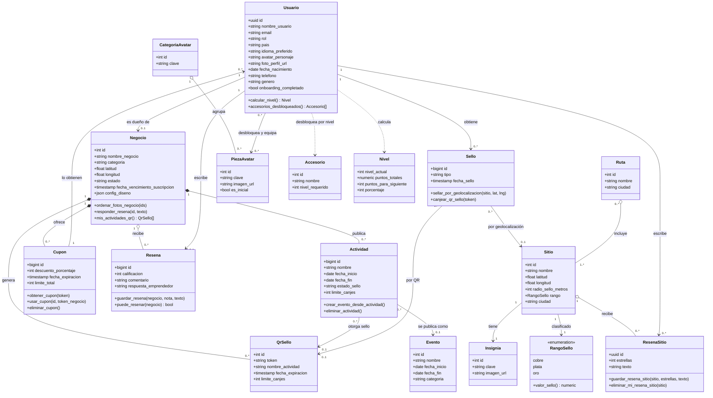

# Diagrama de clases (UML)

Las entidades de la base como clases UML: atributos y operaciones (las operaciones son las funciones RPC de Supabase
que actúan sobre cada entidad). Es el equivalente "orientado a objetos" del modelo ER; la base real de Wheregüense es
relacional (PostgreSQL). Imagen: [`diagrama_clases.png`](diagrama_clases.png).

