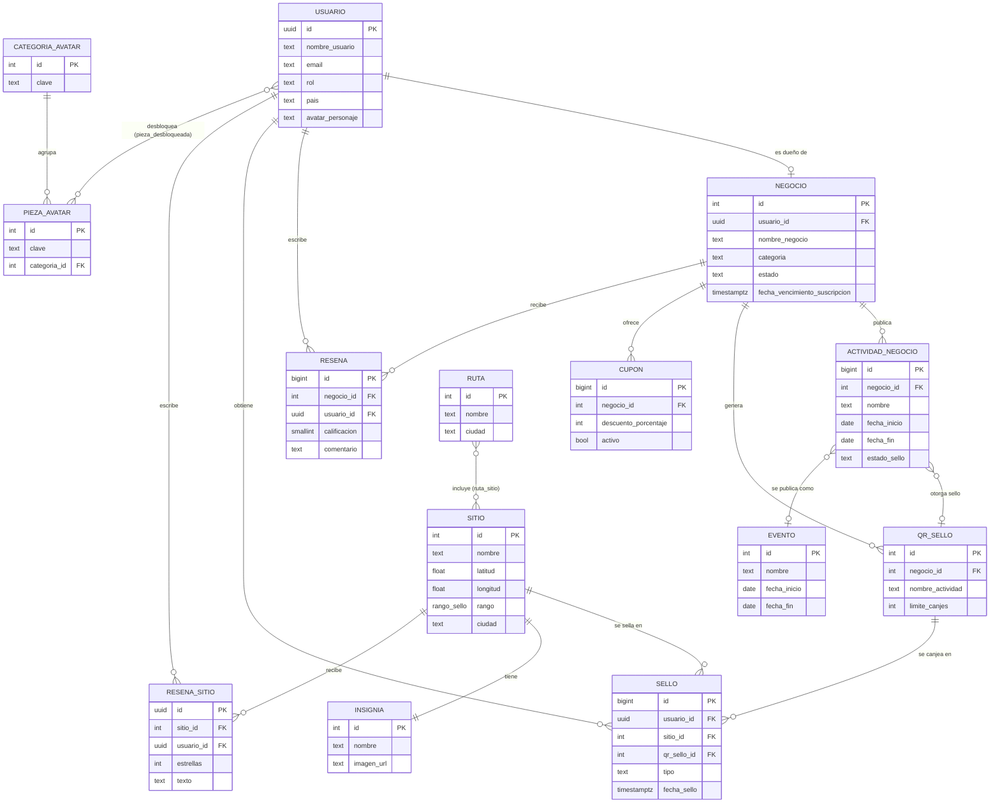

# Modelo ER básico (base de datos relacional)

Modelo entidad-relación simplificado: las entidades del negocio con su clave y sus atributos principales, y las
relaciones con su cardinalidad. El detalle de las 30 tablas está en [`diagrama_base_de_datos.md`](diagrama_base_de_datos.md).
Imagen: [`diagrama_er_basico.png`](diagrama_er_basico.png).

Las relaciones muchos a muchos (`RUTA`–`SITIO` y `USUARIO`–`PIEZA_AVATAR`) se resuelven en el modelo relacional con
las tablas intermedias `ruta_sitio` y `pieza_desbloqueada`, ambas con clave primaria compuesta.
