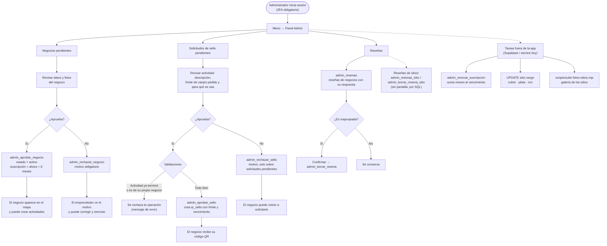

# Flujo del administrador

Aprobar negocios, aprobar sellos y moderar reseñas. Hay una sola cuenta con `rol = 'admin'`.
Imagen: [`diagrama_flujo_admin.png`](diagrama_flujo_admin.png).

```mermaid
flowchart TD
  I(["Administrador inicia sesión<br/>(2FA obligatorio)"]) --> MN["Menú → Panel Admin"]
  MN --> P1["Negocios pendientes"]
  MN --> P2["Solicitudes de sello pendientes"]
  MN --> P3["Reseñas"]

  P1 --> N1["Revisar datos y fotos<br/>del negocio"]
  N1 --> N2{"¿Aprueba?"}
  N2 -->|"Sí"| N3["admin_aprobar_negocio<br/>estado = activo<br/>suscripción = ahora + 6 meses"]
  N2 -->|"No"| N4["admin_rechazar_negocio<br/>motivo obligatorio"]
  N3 --> N5["El negocio aparece en el mapa<br/>y puede crear actividades"]
  N4 --> N6["El emprendedor ve el motivo<br/>y puede corregir y reenviar"]

  P2 --> S1["Revisar actividad: descripción,<br/>límite de canjes pedido y para qué se usa"]
  S1 --> S2{"¿Aprueba?"}
  S2 -->|"Sí"| S3{"Validaciones"}
  S3 -->|"Actividad ya terminó<br/>o es de su propio negocio"| S4["Se rechaza la operación<br/>(mensaje de error)"]
  S3 -->|"Todo bien"| S5["admin_aprobar_sello<br/>crea qr_sello con límite y vencimiento"]
  S2 -->|"No"| S6["admin_rechazar_sello<br/>motivo; solo sobre solicitudes pendientes"]
  S5 --> S7["El negocio recibe su código QR"]
  S6 --> S8["El negocio puede volver a solicitarlo"]

  P3 --> R1["admin_resenas<br/>reseñas de negocios con su respuesta"]
  R1 --> R2{"¿Es inapropiada?"}
  R2 -->|"Sí"| R3["Confirmar → admin_borrar_resena"]
  R2 -->|"No"| R4["Se conserva"]
  P3 -.-> R5["Reseñas de sitios:<br/>admin_resenas_sitio / admin_borrar_resena_sitio<br/>(sin pantalla; por SQL)"]

  MN -.-> X["Tareas fuera de la app<br/>(Supabase / service key)"]
  X --> X1["admin_renovar_suscripcion<br/>suma meses al vencimiento"]
  X --> X2["UPDATE sitio.rango<br/>cobre · plata · oro"]
  X --> X3["scripts/subir-fotos-sitios.mjs<br/>galería de los sitios"]
```
