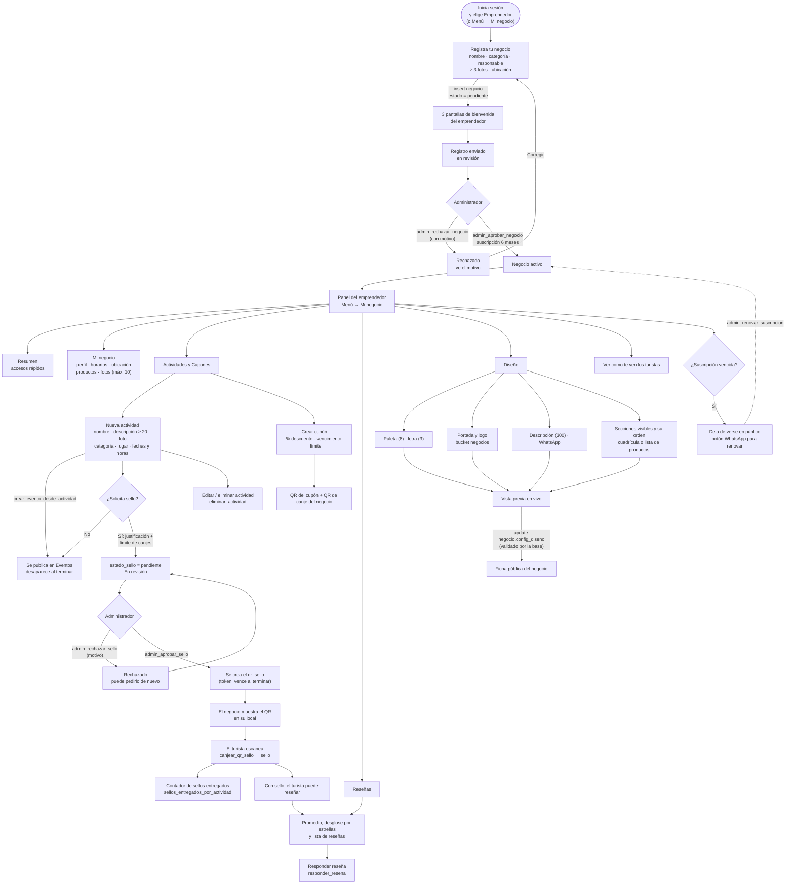

# Flujo del emprendedor

Registro del negocio, panel con sus pestañas, actividades con sello y QR, reseñas y editor de diseño.
Imagen: [`diagrama_flujo_emprendedor.png`](diagrama_flujo_emprendedor.png).

