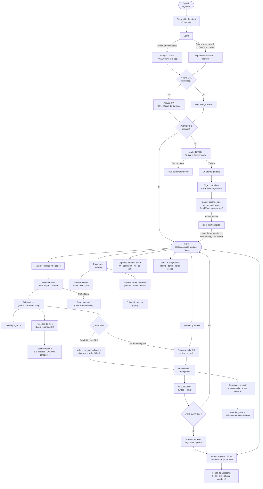

# Flujo del turista

Desde el splash hasta el Inicio, y luego mapa, sellos, pasaporte, niveles y reseñas.
Imagen: [`diagrama_flujo_turista.png`](diagrama_flujo_turista.png).

```mermaid
flowchart TD
  S1(["Splash<br/>Cargando…"]) --> S2["Bienvenida (landing)<br/>Comenzar"]
  S2 --> L["Login"]
  L -->|"Continuar con Google"| G["Google OAuth<br/>(PKCE, vuelve a la app)"]
  L -->|"Correo + contraseña<br/>o Crea una cuenta"| E["signInWithPassword / signUp"]
  G --> M
  E --> M{"¿Tiene 2FA<br/>verificado?"}
  M -->|"No"| M1["Activar 2FA<br/>QR + código de 6 dígitos"]
  M -->|"Sí"| M2["Pedir código TOTP"]
  M1 --> U
  M2 --> U
  U{"¿Completó el<br/>registro?"}
  U -->|"Sí"| INI
  U -->|"No"| P["¿Qué te trae?<br/>Turista o Emprendedor"]
  P -->|"Turista"| C1["Cuaderno: portada"]
  P -.->|"Emprendedor"| EMP["Flujo del emprendedor"]
  C1 --> C2["Elige compañero<br/>Cabezón o Gigantona"]
  C2 --> C3["Datos: usuario, país,<br/>idioma, nacimiento<br/>(+ teléfono, género, foto)"]
  C3 -->|"update usuario"| C4["Sello BIENVENIDO"]
  C4 -->|"guarda personaje +<br/>onboarding_completado"| INI

  INI(["Inicio<br/>sellos, accesos rápidos, rutas"])

  INI --> MAP["Mapa con sitios y negocios"]
  MAP --> SIT["Panel del sitio<br/>Cómo llegar · Guardar"]
  SIT --> FICHA["Ficha del sitio<br/>galería · historia · rango"]
  SIT -->|"Cómo llegar"| RUTA["Ruta peatonal (OpenRouteService)"]
  FICHA --> GAL["Galería y lightbox"]
  FICHA --> RS["Reseñas del sitio<br/>(basta tener sesión)"]
  RS --> RS2["Escribir reseña<br/>1-5 estrellas · 10-1000 caracteres"]
  FICHA --> SEL

  SEL{"¿Cómo sella?"}
  SEL -->|"En el sitio con GPS"| GEO["sellar_por_geolocalizacion<br/>distancia ≤ radio (80 m)"]
  SEL -->|"QR de un negocio"| QR["Escanear sello QR<br/>canjear_qr_sello"]
  GEO --> OK["Sello obtenido<br/>suma puntos"]
  QR --> OK
  OK --> NIV["calcular_nivel<br/>puntos → nivel"]

  INI --> PAS["Pasaporte<br/>ciudades"]
  PAS --> LEON["Sellos de León<br/>Todos / Mis sellos"]
  PAS --> MP["Mi pasaporte (cuaderno)<br/>portada · datos · sellos"]
  MP --> ED["Editar información<br/>(lápiz)"]
  NIV --> HIT{"¿Nivel 5, 10, 15…?"}
  HIT -->|"Sí"| LV["¡Subiste de nivel!<br/>elige 1 de 3 piezas"]
  LV --> AV["Avatar: equipar piezas<br/>sombrero · ropa · rostro"]
  HIT -->|"No"| INI
  INI --> AV
  AV --> TI["Tienda de accesorios<br/>5 · 10 · 20 · 30 (con candado)"]

  OK --> RN["Reseña del negocio<br/>solo con sello de ese negocio"]
  RN --> RN2["guardar_resena<br/>1-5 + comentario 10-2000"]

  INI --> EV["Eventos y detalle"]
  EV --> QR
  INI --> CUP["Cupones: obtener y usar<br/>QR del cupón + QR de canje"]
  INI --> PER["Perfil · Configuración<br/>idioma · tema · cerrar sesión"]
```
