# Normalización: segunda forma normal (2FN)

**Regla:** una tabla está en 2FN si está en 1FN y **ningún atributo que no es clave depende solo de una parte de la clave
primaria**. Solo puede violarla una tabla con **clave compuesta**; las tablas con clave de una sola columna cumplen 2FN
automáticamente. Imagen: [`diagrama_normalizacion_2fn.png`](diagrama_normalizacion_2fn.png).

Resultado: de las 30 tablas, **22 tienen clave simple** y **8 tienen clave compuesta**; en las 8 todo atributo depende
de la clave completa, así que **el esquema cumple 2FN**.

```mermaid
flowchart LR
  subgraph SIMPLE["22 tablas con clave simple → 2FN se cumple por definición"]
    S["usuario · negocio · sitio · sello · resena · resena_sitio<br/>actividad_negocio · qr_sello · evento · cupon · cupon_obtenido<br/>negocio_foto · producto · sitio_foto · ruta · insignia<br/>categoria_avatar · pieza_avatar · accesorio_avatar<br/>negocio_token_canje · nivel · rango"]
  end

  subgraph COMP["8 tablas con clave compuesta: ¿algún atributo depende de solo una parte?"]
    direction TB
    C1["negocio_horario<br/>PK (negocio_id, dia_semana)<br/>hora_apertura, hora_cierre, cerrado<br/>dependen de negocio Y día ✔"]
    C2["ruta_sitio<br/>PK (ruta_id, sitio_id)<br/>orden<br/>depende de la ruta Y el sitio ✔"]
    C3["ruta_guardada<br/>PK (usuario_id, ruta_id)<br/>fecha_guardado<br/>depende del usuario Y la ruta ✔"]
    C4["pieza_desbloqueada<br/>PK (usuario_id, pieza_id)<br/>nivel_hito, fecha_desbloqueo<br/>dependen del usuario Y la pieza ✔"]
    C5["avatar_equipado<br/>PK (usuario_id, categoria_id)<br/>pieza_id<br/>depende del usuario Y la categoría ✔"]
    C6["usuario_hito<br/>PK (usuario_id, nivel_hito)<br/>pieza_elegida_id, fecha_generado, fecha_resuelto<br/>dependen del usuario Y el hito ✔"]
    C7["hito_candidato<br/>PK (usuario_id, nivel_hito, pieza_id)<br/>sin atributos fuera de la clave ✔"]
    C8["guardado<br/>PK (usuario_id, tipo, referencia_id)<br/>datos, fecha_guardado<br/>dependen de los tres ✔"]
  end

  SIMPLE --> OK
  COMP --> OK
  OK(["✔ 2FN: ningún atributo<br/>depende de una parte de la clave"])

  subgraph OBS["Observaciones (no rompen 2FN)"]
    direction TB
    O1["1FN estricta: etiquetas (text[]) y config_diseno,<br/>guardado.datos (jsonb) no son atómicos.<br/>Decisión de diseño; la base los valida con CHECK"]
    O2["sello.tipo se deduce de cuál FK está presente<br/>(sitio_id o qr_sello_id): redundancia"]
    O3["usuario.email repite auth.users.email"]
    O4["negocio.suscripcion_activa convive con<br/>fecha_vencimiento_suscripcion"]
    O5["nivel y rango (por cantidad de sellos)<br/>quedaron sin uso desde la migración 038"]
  end

  OK -.-> OBS
```

## Verificación tabla por tabla (claves compuestas)

| Tabla | Clave primaria | Atributos no clave | ¿Dependen de toda la clave? |
| --- | --- | --- | --- |
| `negocio_horario` | `negocio_id, dia_semana` | `hora_apertura`, `hora_cierre`, `cerrado` | Sí: el horario es de *ese negocio en ese día* |
| `ruta_sitio` | `ruta_id, sitio_id` | `orden` | Sí: el orden es de *ese sitio en esa ruta* |
| `ruta_guardada` | `usuario_id, ruta_id` | `fecha_guardado` | Sí |
| `pieza_desbloqueada` | `usuario_id, pieza_id` | `nivel_hito`, `fecha_desbloqueo` | Sí: cuándo *ese usuario* obtuvo *esa pieza* |
| `avatar_equipado` | `usuario_id, categoria_id` | `pieza_id` | Sí: qué pieza lleva *ese usuario* en *esa categoría* (la FK `(pieza_id, categoria_id)` impide piezas de otra categoría) |
| `usuario_hito` | `usuario_id, nivel_hito` | `pieza_elegida_id`, `fecha_generado`, `fecha_resuelto` | Sí |
| `hito_candidato` | `usuario_id, nivel_hito, pieza_id` | — | No tiene atributos fuera de la clave |
| `guardado` | `usuario_id, tipo, referencia_id` | `datos`, `fecha_guardado` | Sí |

Las tablas con clave simple (`id`) tienen además restricciones únicas sobre combinaciones de negocio que **no**
cambian la clave: `resena (negocio_id, usuario_id)`, `resena_sitio (sitio_id, usuario_id)`, `sello (usuario_id, sitio_id)`,
`cupon_obtenido (cupon_id, usuario_id)` y `sitio_foto (sitio_id, orden)`.
