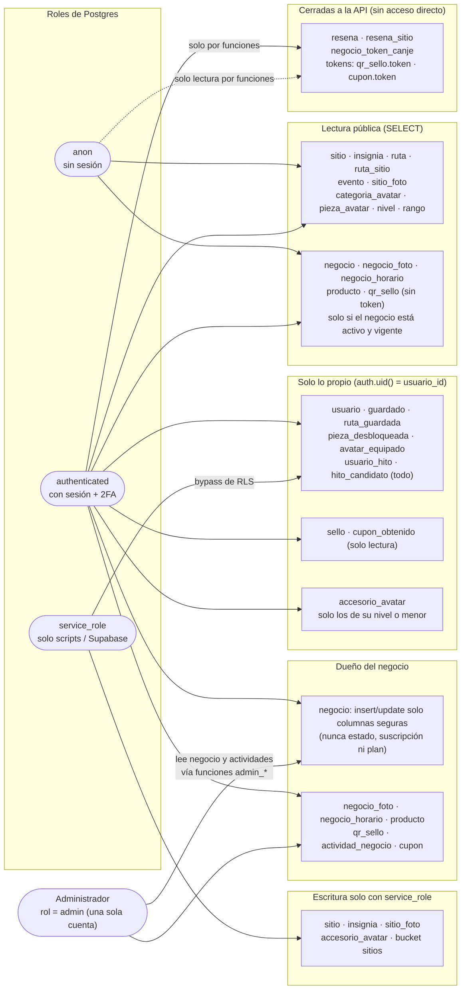
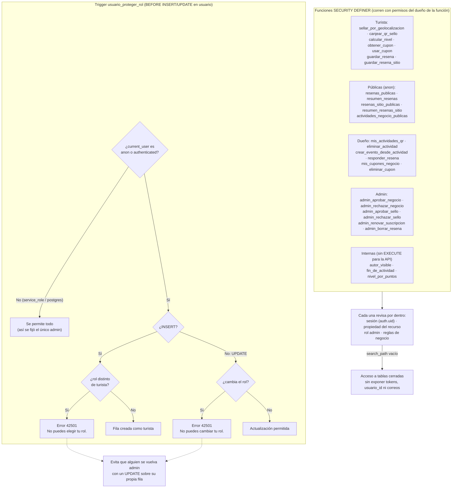

# Diagrama de seguridad

RLS por tabla, roles de Postgres (`anon`, `authenticated`, `service_role`), funciones `SECURITY DEFINER` y el trigger
`usuario_proteger_rol`. Imágenes: [`diagrama_seguridad.png`](diagrama_seguridad.png) y
[`diagrama_seguridad_2.png`](diagrama_seguridad_2.png).

## 1. Roles y RLS por tabla

## 2. Funciones SECURITY DEFINER y trigger de rol

