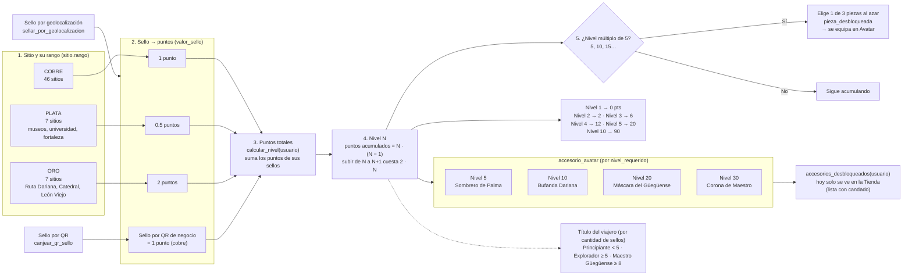

# Sistema de sellos, niveles y accesorios

Sitio → rango (cobre/plata/oro) → puntos del sello → puntos totales → nivel → recompensas.
Imagen: [`diagrama_sistema_sellos.png`](diagrama_sistema_sellos.png).

